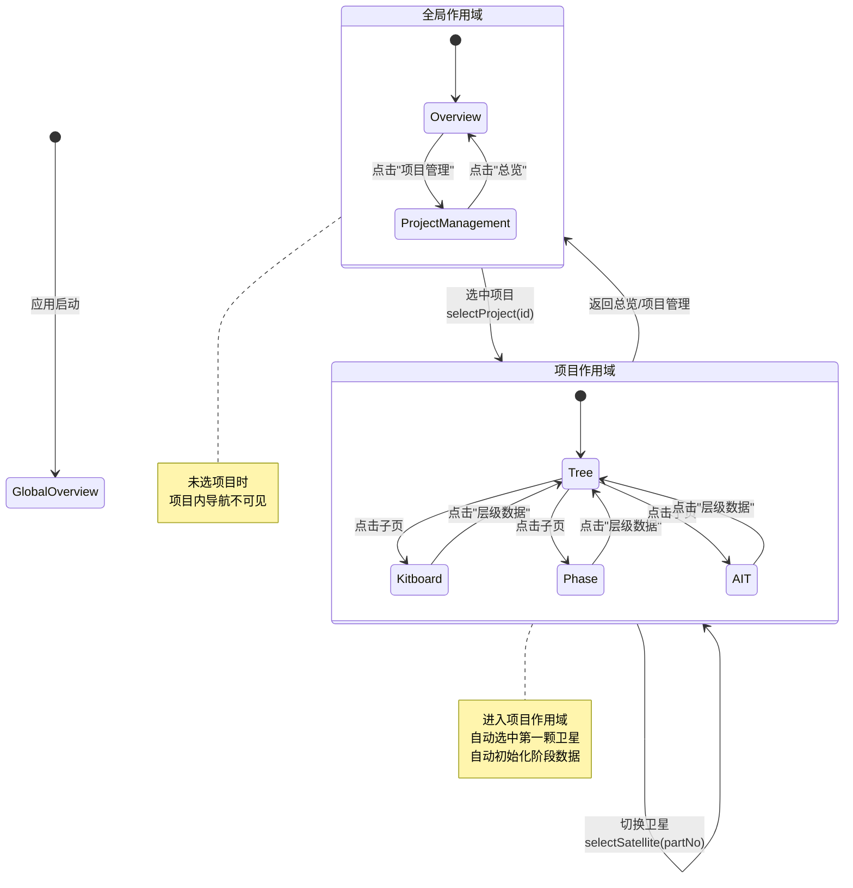
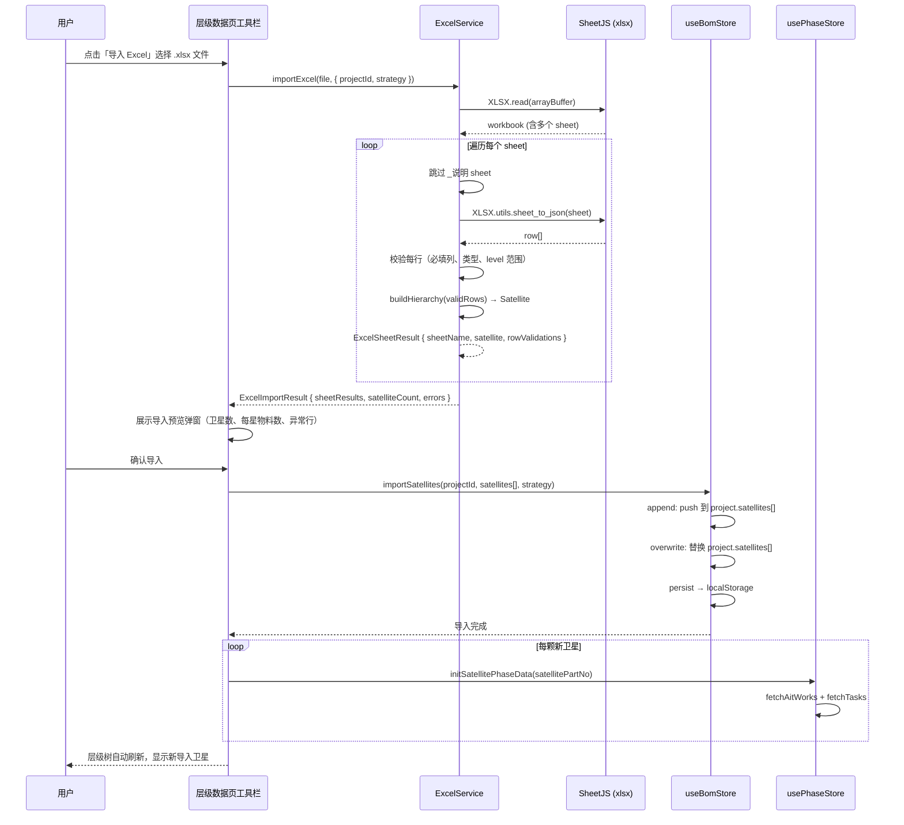
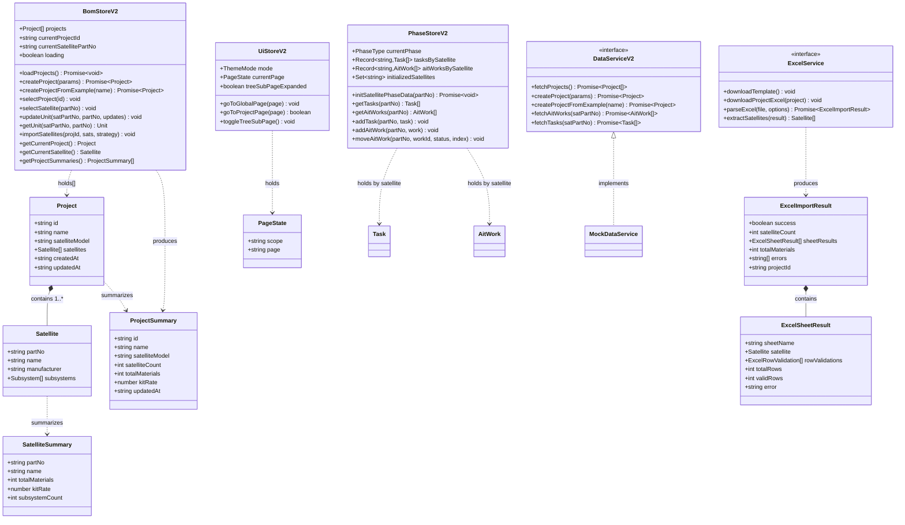
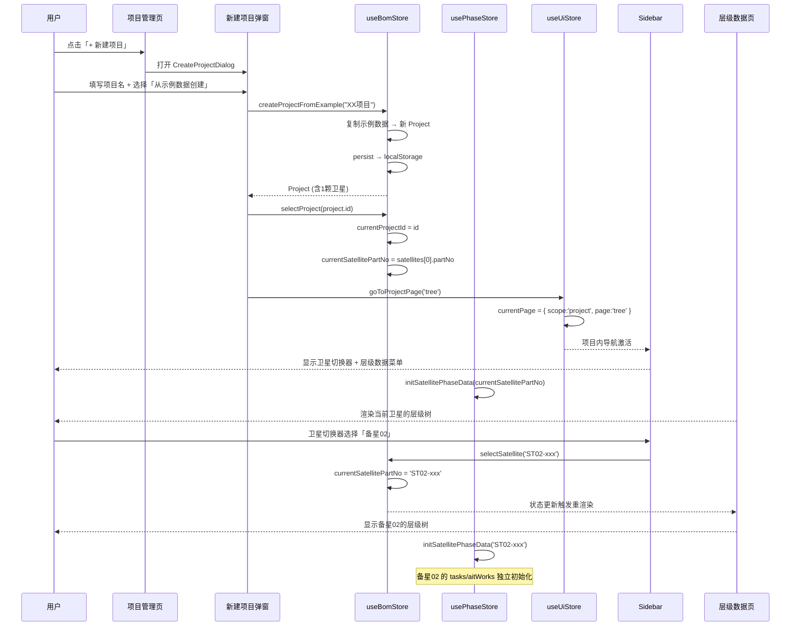
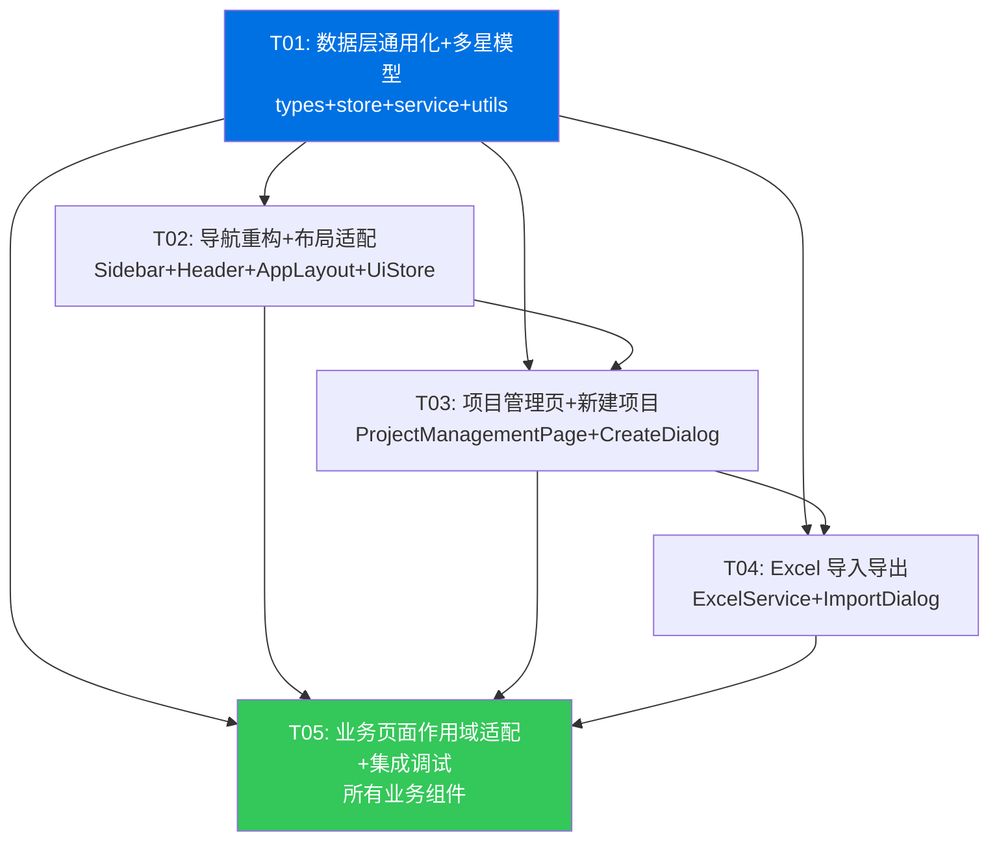

# 增量架构设计 v2 — 卫星制造项目管理系统通用化改造

> **版本**：v2-incremental
> **日期**：2026-06-26
> **编写人**：高见远（架构师）
> **基准版本**：v1.0 架构（见 `ARCHITECTURE.md`），38 源文件已通过 tsc + build
> **依据**：增量 PRD v2（许清楚）
> **文档性质**：增量文档，仅描述本次 4 项变更的架构影响，不重复已有架构内容

---

## 目录

- [1. 数据模型变更](#1-数据模型变更)
- [2. Store 变更方案](#2-store-变更方案)
- [3. 导航重构方案](#3-导航重构方案)
- [4. Excel 导入/导出方案](#4-excel-导入导出方案)
- [5. 影响文件清单](#5-影响文件清单)
- [6. 任务列表（增量）](#6-任务列表增量)
- [7. 依赖包新增](#7-依赖包新增)
- [8. 增量类图](#8-增量类图)
- [9. 增量时序图](#9-增量时序图)
- [10. 待明确事项](#10-待明确事项)

---

## 1. 数据模型变更

### 1.1 核心模型变更总览

| 模型 | v1.0 | v2 | 变更说明 |
|------|------|-----|----------|
| `Project` | `satellite: Satellite` | `satellites: Satellite[]` | 单星→多星数组 |
| `Project` | `id: 'proj-lx10b-001'` 硬编码 | `id` 运行时生成 | 去硬编码 |
| `Project` | `name: '灵犀10B'` 硬编码 | `name` 用户填写/导入生成 | 去硬编码 |
| `Project` | — | `createdAt: string` | 新增创建时间 |
| `Project` | — | `updatedAt: string` | 新增更新时间 |
| `PageType` | 5 项平铺联合类型 | 两级结构 `{ scope, page }` | 导航重构 |
| `DataService` | `fetchProject()` 单项目 | `fetchProject()` + `fetchProjects()` | 多项目支持 |

### 1.2 TypeScript 类型定义（增量变更）

```typescript
// ============================================================
// src/types/index.ts — 增量变更部分
// 以下仅列出新增/修改的类型，未列出的类型保持 v1.0 不变
// ============================================================

// ---------- PageType 重构：两级导航 ----------
/** 全局页面（无需选中项目） */
export type GlobalPage = 'overview' | 'project-management';

/** 项目内主页面（选中项目后激活） */
export type ProjectPage = 'tree' | 'kitboard' | 'phase' | 'ait';

/** 两级页面状态 */
export interface PageState {
  scope: 'global' | 'project';
  page: GlobalPage | ProjectPage;
}

// ---------- Project 模型变更 ----------
export interface Project {
  id: string;
  /** 项目名称，用户填写或导入生成，不再硬编码 */
  name: string;
  /** 卫星型号 */
  satelliteModel: string;
  /** 卫星列表（v1.0 的 satellite 单数改为复数数组） */
  satellites: Satellite[];
  /** 创建时间 ISO 8601 */
  createdAt: string;
  /** 最后更新时间 ISO 8601 */
  updatedAt: string;
}

// ---------- Satellite 模型（保持不变，确认列出） ----------
export interface Satellite {
  partNo: string;
  name: string;
  manufacturer: string;
  subsystems: Subsystem[];
}

// ---------- 新增：项目摘要（列表页用） ----------
export interface ProjectSummary {
  id: string;
  name: string;
  satelliteModel: string;
  satelliteCount: number;
  totalMaterials: number;
  kitRate: number;
  updatedAt: string;
}

// ---------- 新增：单星摘要（项目内卫星切换/对比用） ----------
export interface SatelliteSummary {
  partNo: string;
  name: string;
  totalMaterials: number;
  kitRate: number;
  subsystemCount: number;
}

// ---------- 新增：Excel 导入相关类型 ----------

/** Excel 模板列定义 */
export interface ExcelColumn {
  /** 列序（A=0, B=1, ...） */
  index: number;
  /** 中文列名 */
  label: string;
  /** 对应字段名 */
  field: string;
  /** 是否必填 */
  required: boolean;
}

/** Excel 导入预览项（单行校验结果） */
export interface ExcelRowValidation {
  /** 行号（从 2 开始，1 为表头） */
  row: number;
  /** 料号 */
  partNo: string;
  /** 品名 */
  name: string;
  /** 是否有效 */
  valid: boolean;
  /** 错误信息（valid=false 时） */
  errors: string[];
}

/** 单个 sheet 的解析结果（对应一颗卫星） */
export interface ExcelSheetResult {
  /** sheet 名（= 卫星名） */
  sheetName: string;
  /** 解析出的卫星（解析成功时） */
  satellite: Satellite | null;
  /** 行校验结果列表 */
  rowValidations: ExcelRowValidation[];
  /** 物料总数 */
  totalRows: number;
  /** 有效行数 */
  validRows: number;
  /** 错误信息（解析失败时） */
  error: string | null;
}

/** Excel 导入总体结果 */
export interface ExcelImportResult {
  /** 是否成功 */
  success: boolean;
  /** 导入的卫星数量 */
  satelliteCount: number;
  /** 每个 sheet 的解析结果 */
  sheetResults: ExcelSheetResult[];
  /** 总物料数 */
  totalMaterials: number;
  /** 错误汇总 */
  errors: string[];
  /** 导入的项目 ID（导入到哪个项目） */
  projectId: string;
}

/** Excel 导入选项 */
export interface ExcelImportOptions {
  /** 导入策略：append=追加卫星，overwrite=覆盖项目 */
  strategy: 'append' | 'overwrite';
  /** 目标项目 ID */
  projectId: string;
  /** 是否跳过无效行 */
  skipInvalidRows: boolean;
}

// ---------- DataService 接口扩展 ----------
export interface DataService {
  /** 获取原始 BOM JSON 树（示例数据） */
  fetchBomTree(): Promise<RawBomNode>;
  /** 获取示例项目（灵犀10B 示例数据） */
  fetchProject(): Promise<Project>;
  /** [新增] 获取所有项目列表 */
  fetchProjects(): Promise<Project[]>;
  /** [新增] 创建新项目 */
  createProject(params: {
    name: string;
    satelliteModel: string;
  }): Promise<Project>;
  /** [新增] 从示例数据创建项目（复制灵犀10B 数据为种子） */
  createProjectFromExample(name: string): Promise<Project>;
  /** 获取预置 AIT 工作项（按卫星作用域） */
  fetchAitWorks(satellitePartNo?: string): Promise<AitWork[]>;
  /** 获取预置临时任务（按卫星作用域） */
  fetchTasks(satellitePartNo?: string): Promise<Task[]>;
}
```

### 1.3 兼容性策略

由于 Demo 阶段无生产数据迁移需求，采用**一次性切换**策略：

- `Project.satellite`（单数）→ `Project.satellites`（复数数组），不保留旧字段
- `PageType`（平铺联合）→ `PageState`（两级对象），旧类型删除
- localStorage 中的 `bom-storage` 数据结构变更，首次加载时检测旧格式并自动清空重建
- 测试文件中 `project.satellite` 引用同步更新为 `project.satellites[0]`

---

## 2. Store 变更方案

### 2.1 Store 架构决策

| 决策 | 选择 | 理由 |
|------|------|------|
| 是否新增 `useProjectStore` | **不新增，合并到 `useBomStore`** | 项目列表本质是多个 Project 的集合，与 BOM 数据同源；拆分会导致 Store 间频繁互调；保持 3 Store 架构不变 |
| 作用域状态存放位置 | `useBomStore` 持 `currentProjectId` + `currentSatellitePartNo` | 作用域是数据上下文，归属数据层 |
| PhaseStore 作用域隔离方式 | `tasks` / `aitWorks` 改为 `Record<string, Task[]>` 按 `satellitePartNo` 分组 | 切换卫星时 O(1) 读取，无需重新加载 |

### 2.2 useBomStore 变更

```typescript
// ============================================================
// src/store/useBomStore.ts — v2 增量变更
// ============================================================

interface BomState {
  // ===== v1.0 字段变更 =====
  /** [变更] v1.0 project: Project | null → v2 projects: Project[] */
  projects: Project[];
  /** [新增] 当前选中的项目 ID */
  currentProjectId: string | null;
  /** [新增] 当前选中的卫星 partNo（项目内作用域） */
  currentSatellitePartNo: string | null;
  /** loading 状态（保持） */
  loading: boolean;
  /** error 状态（保持） */
  error: string | null;
  /** initialized 标记（保持） */
  initialized: boolean;

  // ===== v1.0 方法变更 =====
  /** [变更] 加载所有项目（首次加载预置示例项目） */
  loadProjects: () => Promise<void>;
  /** [废弃] loadBom() → loadProjects() */
  /** [变更] updateUnit 增加卫星作用域参数 */
  updateUnit: (
    satellitePartNo: string,
    partNo: string,
    updates: Partial<Unit>,
  ) => void;
  /** [变更] getUnit 增加卫星作用域参数 */
  getUnit: (
    satellitePartNo: string,
    partNo: string,
  ) => Unit | undefined;
  /** [变更] resetData → 重置当前项目或全部 */
  resetProject: (projectId: string) => Promise<void>;
  resetAll: () => Promise<void>;

  // ===== v2 新增方法 =====
  /** 创建新项目 */
  createProject: (params: {
    name: string;
    satelliteModel: string;
  }) => Promise<Project>;
  /** 从示例数据创建项目 */
  createProjectFromExample: (name: string) => Promise<Project>;
  /** 删除项目 */
  deleteProject: (projectId: string) => void;
  /** 选中项目（设置 currentProjectId） */
  selectProject: (projectId: string | null) => void;
  /** 选中卫星（设置 currentSatellitePartNo） */
  selectSatellite: (satellitePartNo: string | null) => void;
  /** Excel 导入：将解析后的卫星列表追加/覆盖到项目 */
  importSatellites: (
    projectId: string,
    satellites: Satellite[],
    strategy: 'append' | 'overwrite',
  ) => void;
  /** 获取当前项目（派生 getter） */
  getCurrentProject: () => Project | null;
  /** 获取当前卫星（派生 getter） */
  getCurrentSatellite: () => Satellite | null;
  /** 获取项目摘要列表 */
  getProjectSummaries: () => ProjectSummary[];
}
```

**持久化策略变更**：

```typescript
// persist 配置
{
  name: 'bom-storage',
  partialize: (s) => ({
    projects: s.projects,
    currentProjectId: s.currentProjectId,
    currentSatellitePartNo: s.currentSatellitePartNo,
    initialized: s.initialized,
  }),
  // 版本迁移：检测旧格式（单数 satellite）自动清空
  version: 2,
  migrate: (persistedState: any, version: number) => {
    if (version < 2) {
      // 旧格式数据，清空重建
      return { projects: [], currentProjectId: null, currentSatellitePartNo: null, initialized: false };
    }
    return persistedState;
  },
}
```

**updateUnit 不可变更新变更**：

```typescript
// v1.0: project.satellite.subsystems → 扁平遍历
// v2: projects[id].satellites[partNo].subsystems → 双层定位
updateUnit: (satellitePartNo, partNo, updates) => {
  set((state) => ({
    projects: state.projects.map((p) => {
      if (p.id !== state.currentProjectId) return p;
      return {
        ...p,
        updatedAt: new Date().toISOString(),
        satellites: p.satellites.map((sat) => {
          if (sat.partNo !== satellitePartNo) return sat;
          return {
            ...sat,
            subsystems: sat.subsystems.map((sub) => ({
              ...sub,
              units: sub.units.map((u) =>
                u.partNo === partNo ? { ...u, ...updates } : u,
              ),
            })),
          };
        }),
      };
    }),
  }));
},
```

### 2.3 usePhaseStore 变更

```typescript
// ============================================================
// src/store/usePhaseStore.ts — v2 增量变更
// ============================================================

interface PhaseState {
  /** 当前阶段（保持，项目级共享） */
  currentPhase: PhaseType;

  // ===== v2 核心变更：按卫星作用域分组 =====
  /** [变更] tasks 按 satellitePartNo 分组存储 */
  tasksBySatellite: Record<string, Task[]>;
  /** [变更] aitWorks 按 satellitePartNo 分组存储 */
  aitWorksBySatellite: Record<string, AitWork[]>;
  /** [新增] 已初始化的卫星 partNo 集合 */
  initializedSatellites: Set<string>;

  // ===== 方法变更 =====
  /** [变更] 初始化指定卫星的阶段数据 */
  initSatellitePhaseData: (satellitePartNo: string) => Promise<void>;
  /** [新增] 获取当前卫星的任务列表 */
  getTasks: (satellitePartNo: string) => Task[];
  /** [新增] 获取当前卫星的 AIT 工作项 */
  getAitWorks: (satellitePartNo: string) => AitWork[];
  /** [变更] 添加任务（带卫星作用域） */
  addTask: (satellitePartNo: string, task: Omit<Task, 'id'>) => void;
  /** [变更] 删除任务（带卫星作用域） */
  removeTask: (satellitePartNo: string, taskId: string) => void;
  /** [变更] 添加 AIT 工作项（带卫星作用域） */
  addAitWork: (satellitePartNo: string, work: Omit<AitWork, 'id'>) => void;
  /** [变更] 删除 AIT 工作项（带卫星作用域） */
  removeAitWork: (satellitePartNo: string, workId: string) => void;
  /** [变更] 移动 AIT 工作项（带卫星作用域） */
  moveAitWork: (
    satellitePartNo: string,
    workId: string,
    toStatus: AitWorkStatus,
    toIndex: number,
  ) => void;
  /** [变更] 更新 AIT 工作项（带卫星作用域） */
  updateAitWork: (
    satellitePartNo: string,
    workId: string,
    updates: Partial<AitWork>,
  ) => void;

  /** 切换当前阶段（保持不变） */
  setCurrentPhase: (phase: PhaseType) => void;
}
```

**作用域隔离机制**：

```typescript
// 切换卫星时，自动初始化新卫星的阶段数据
initSatellitePhaseData: async (satellitePartNo) => {
  const state = get();
  if (state.initializedSatellites.has(satellitePartNo)) return;

  const [tasks, aitWorks] = await Promise.all([
    dataService.fetchTasks(satellitePartNo),
    dataService.fetchAitWorks(satellitePartNo),
  ]);

  set((s) => ({
    tasksBySatellite: {
      ...s.tasksBySatellite,
      [satellitePartNo]: tasks,
    },
    aitWorksBySatellite: {
      ...s.aitWorksBySatellite,
      [satellitePartNo]: aitWorks,
    },
    initializedSatellites: new Set([...s.initializedSatellites, satellitePartNo]),
  }));
},
```

### 2.4 useUiStore 变更

```typescript
// ============================================================
// src/store/useUiStore.ts — v2 增量变更
// ============================================================

interface UiState {
  /** 主题模式（保持） */
  mode: ThemeMode;

  // ===== v2 核心变更：PageType → PageState =====
  /** [变更] v1.0 currentPage: PageType → v2 currentPage: PageState */
  currentPage: PageState;

  /** 选中的树节点 partNo（保持） */
  selectedNodePartNo: string | null;
  /** 展开的树节点（保持） */
  expandedNodes: Record<string, boolean>;
  /** 齐套筛选（保持） */
  kitFilter: KitFilter;
  /** 移动端 Drawer（保持） */
  mobileDrawerOpen: boolean;

  // ===== 方法变更 =====
  /** [变更] setPage 接收 PageState */
  setPage: (page: PageState) => void;
  /** [新增] 快捷导航到全局页面 */
  goToGlobalPage: (page: GlobalPage) => void;
  /** [新增] 快捷导航到项目内页面（自动检查是否已选项目） */
  goToProjectPage: (page: ProjectPage) => boolean; // 返回 false 表示未选项目，导航失败
  /** [新增] 层级数据子页展开/折叠状态 */
  treeSubPageExpanded: boolean;
  /** [新增] 切换层级数据子页展开 */
  toggleTreeSubPage: () => void;

  // 保持不变的方法
  toggleTheme: () => void;
  selectNode: (partNo: string | null) => void;
  toggleNode: (partNo: string) => void;
  setKitFilter: (filter: KitFilter) => void;
  toggleMobileDrawer: () => void;
  setMobileDrawer: (open: boolean) => void;
}
```

**初始状态变更**：

```typescript
// v1.0: currentPage: 'overview'
// v2: currentPage: { scope: 'global', page: 'overview' }
currentPage: { scope: 'global', page: 'overview' },
treeSubPageExpanded: true,  // 默认展开层级数据子菜单
```

**goToProjectPage 路由守卫**：

```typescript
goToProjectPage: (page) => {
  const bomState = useBomStore.getState();
  if (!bomState.currentProjectId) {
    // 未选项目，重定向到项目管理
    set({ currentPage: { scope: 'global', page: 'project-management' } });
    return false;
  }
  set({ currentPage: { scope: 'project', page }, mobileDrawerOpen: false });
  return true;
},
```

### 2.5 Store 关系图

```mermaid
graph TB
    subgraph "v2 Store 架构"
        BomStore[useBomStore<br/>projects: Project[]<br/>currentProjectId<br/>currentSatellitePartNo]
        PhaseStore[usePhaseStore<br/>tasksBySatellite: Record<br/>aitWorksBySatellite: Record]
        UiStore[useUiStore<br/>currentPage: PageState<br/>treeSubPageExpanded]
    end

    BomStore -->|currentSatellitePartNo| PhaseStore
    BomStore -->|currentProjectId| UiStore
    UiStore -->|goToProjectPage 检查| BomStore
    PhaseStore -->|按 satellitePartNo 隔离| BomStore

    style BomStore fill:#0071E3,color:#fff
    style PhaseStore fill:#FF9500,color:#fff
    style UiStore fill:#34C759,color:#fff
```

---

## 3. 导航重构方案

### 3.1 新 PageState 定义

```typescript
// 两级页面状态
export interface PageState {
  scope: 'global' | 'project';
  page: GlobalPage | ProjectPage;
}

// 全局页面（无需选中项目）
export type GlobalPage = 'overview' | 'project-management';

// 项目内页面（选中项目后激活）
export type ProjectPage = 'tree' | 'kitboard' | 'phase' | 'ait';
```

### 3.2 导航结构对照

```
v1.0（5 项平铺，全局）          v2（两层，作用域化）
┌──────────────────┐           ┌──────────────────────────────┐
│ 📊 总览           │           │ 📊 总览              (全局)  │
│ 🌳 层级数据       │           │ 📁 项目管理          (全局)  │
│ ✅ BOM 齐套       │    →      ├──────────────────────────────┤
│ 📋 阶段管理       │           │ ▼ [当前项目名]               │
│ ⚙️ AIT 编排       │           │   🛰️ 卫星: [灵犀10B ▾]      │
│                  │           │   🌳 层级数据        (主入口) │
│                  │           │     ✅ BOM 齐套      (子页)  │
│                  │           │     📋 阶段管理      (子页)  │
│                  │           │     ⚙️ AIT 编排      (子页)  │
└──────────────────┘           └──────────────────────────────┘
```

### 3.3 路由状态机



### 3.4 Sidebar 新结构

```typescript
// ============================================================
// src/components/layout/Sidebar.tsx — v2 两层导航
// ============================================================

/** 全局导航项 */
const GLOBAL_NAV_ITEMS: { page: GlobalPage; label: string; icon: ReactElement }[] = [
  { page: 'overview', label: '总览', icon: <DashboardIcon /> },
  { page: 'project-management', label: '项目管理', icon: <FolderIcon /> },
];

/** 项目内导航项（层级数据为父级，其余为子页） */
const PROJECT_NAV_PARENT = { page: 'tree', label: '层级数据', icon: <TreeIcon /> };
const PROJECT_NAV_CHILDREN: { page: ProjectPage; label: string; icon: ReactElement }[] = [
  { page: 'kitboard', label: 'BOM 齐套', icon: <KitIcon /> },
  { page: 'phase', label: '阶段管理', icon: <PhaseIcon /> },
  { page: 'ait', label: 'AIT 编排', icon: <AitIcon /> },
];
```

**渲染逻辑**：

```tsx
function NavContent(): React.ReactElement {
  const currentPage = useUiStore((s) => s.currentPage);
  const treeSubPageExpanded = useUiStore((s) => s.treeSubPageExpanded);
  const toggleTreeSubPage = useUiStore((s) => s.toggleTreeSubPage);
  const goToGlobalPage = useUiStore((s) => s.goToGlobalPage);
  const goToProjectPage = useUiStore((s) => s.goToProjectPage);

  const currentProject = useBomStore((s) => s.getCurrentProject());
  const currentSatellitePartNo = useBomStore((s) => s.currentSatellitePartNo);
  const selectSatellite = useBomStore((s) => s.selectSatellite);

  return (
    <List>
      {/* === 全局导航 === */}
      <Typography variant="caption">全局</Typography>
      {GLOBAL_NAV_ITEMS.map(item => (
        <ListItemButton
          selected={currentPage.scope === 'global' && currentPage.page === item.page}
          onClick={() => goToGlobalPage(item.page)}
        >
          <ListItemIcon>{item.icon}</ListItemIcon>
          <ListItemText primary={item.label} />
        </ListItemButton>
      ))}

      <Divider />

      {/* === 项目内导航 === */}
      {currentProject ? (
        <>
          {/* 项目名标题 */}
          <Typography variant="caption">{currentProject.name}</Typography>

          {/* 卫星切换器 */}
          <SatelliteSwitcher
            satellites={currentProject.satellites}
            currentPartNo={currentSatellitePartNo}
            onChange={selectSatellite}
          />

          {/* 层级数据（父级入口） */}
          <ListItemButton
            selected={currentPage.scope === 'project' && currentPage.page === 'tree'}
            onClick={() => goToProjectPage('tree')}
          >
            <ListItemIcon><TreeIcon /></ListItemIcon>
            <ListItemText primary="层级数据" />
            <IconButton onClick={(e) => { e.stopPropagation(); toggleTreeSubPage(); }}>
              {treeSubPageExpanded ? <ExpandLess /> : <ExpandMore />}
            </IconButton>
          </ListItemButton>

          {/* 子页（折叠/展开） */}
          <Collapse in={treeSubPageExpanded}>
            {PROJECT_NAV_CHILDREN.map(item => (
              <ListItemButton
                sx={{ pl: 4 }}
                selected={currentPage.scope === 'project' && currentPage.page === item.page}
                onClick={() => goToProjectPage(item.page)}
              >
                <ListItemIcon>{item.icon}</ListItemIcon>
                <ListItemText primary={item.label} />
              </ListItemButton>
            ))}
          </Collapse>
        </>
      ) : (
        <Box sx={{ p: 2, textAlign: 'center' }}>
          <Typography variant="body2" color="text.secondary">
            请先选择项目
          </Typography>
        </Box>
      )}
    </List>
  );
}
```

### 3.5 卫星切换器组件

```typescript
// ============================================================
// src/components/layout/SatelliteSwitcher.tsx — 新增文件
// ============================================================

interface SatelliteSwitcherProps {
  satellites: Satellite[];
  currentPartNo: string | null;
  onChange: (partNo: string) => void;
}

// 实现：MUI Select 下拉，显示卫星名，切换时触发 onChange
// 超过 5 颗时自动启用 Autocomplete 搜索模式
```

### 3.6 面包屑（P1）

```typescript
// 在 Header 下方渲染面包屑
// 路径：项目管理 > [项目名] > [卫星名] > [当前页名]
// 各层级可点击回溯
const BREADCRUMB_MAP: Record<string, string> = {
  overview: '总览',
  'project-management': '项目管理',
  tree: '层级数据',
  kitboard: 'BOM 齐套',
  phase: '阶段管理',
  ait: 'AIT 编排',
};
```

---

## 4. Excel 导入/导出方案

### 4.1 库选型

| 候选 | 优势 | 劣势 | 决策 |
|------|------|------|------|
| **SheetJS (xlsx)** | 纯前端、无后端依赖、社区版免费、支持读写、生态成熟 | 社区版不支持样式（Pro 才支持） | ✅ **选用** |
| ExcelJS | 支持样式、单元格格式 | API 较重、包体积大 | ❌ |
| 后端解析（Node + exceljs） | 功能最全 | Demo 阶段无后端 | ❌ |

**安装**：`xlsx` 包（SheetJS 社区版）

### 4.2 模板结构

#### 4.2.1 列定义

```typescript
// ============================================================
// src/services/ExcelService.ts — 模板列定义
// ============================================================

/** Excel 模板固定列定义（与 PRD 2.4.1 对齐） */
export const EXCEL_COLUMNS: ExcelColumn[] = [
  { index: 0,  label: '层级',         field: 'level',             required: true  },
  { index: 1,  label: '料号',         field: 'part_no',           required: true  },
  { index: 2,  label: '品名',         field: 'name',              required: true  },
  { index: 3,  label: '规格',         field: 'spec',              required: false },
  { index: 4,  label: '封装形式',     field: 'form',              required: false },
  { index: 5,  label: '厂家',         field: 'manufacturer',      required: false },
  { index: 6,  label: '质量等级',     field: 'quality_level',     required: false },
  { index: 7,  label: '用量',         field: 'quantity',          required: false },
  { index: 8,  label: '位号',         field: 'location',          required: false },
  { index: 9,  label: '单位',         field: 'unit',              required: false },
  { index: 10, label: '类型',         field: 'type',              required: false },
  { index: 11, label: '电性件齐套',   field: 'electrical',        required: false },
  { index: 12, label: '鉴定件齐套',   field: 'qualification',     required: false },
  { index: 13, label: '正样件齐套',   field: 'flight',            required: false },
  { index: 14, label: '在整星中',     field: 'in_satellite',      required: false },
  { index: 15, label: '投产状态',     field: 'production_status', required: false },
  { index: 16, label: '交付日期',     field: 'delivery_date',     required: false },
];
```

#### 4.2.2 Sheet 规则

| 规则 | 说明 |
|------|------|
| 单星项目 | 1 个 sheet，sheet 名 = 卫星名 |
| 多星项目 | 多个 sheet，每个 sheet 名 = 对应卫星名 |
| 第一个 sheet | 必须是卫星 BOM 数据（不允许说明 sheet 在首位） |
| 说明 sheet | 可选追加名为「_说明」的 sheet（下划线前缀跳过解析） |

#### 4.2.3 层级表示方案

采用 **`level` 数字列 + 行顺序** 方案（PRD IQ3 建议），同时支持可选的 `parent_part_no` 列提升容错：

| 行 | level | part_no | name | ... | parent_part_no（可选） |
|----|-------|---------|------|-----|----------------------|
| 2 | 1 | ST01-220041 | 灵犀10B卫星 | ... | (空) |
| 3 | 2 | SB0101-220010 | 姿轨控分系统 | ... | ST01-220041 |
| 4 | 3 | EQ0101-220010 | 反作用飞轮 | ... | SB0101-220010 |
| 5 | 3 | EQ0102-000002 | 星敏 | ... | SB0101-220010 |

**解析逻辑**：

```typescript
function buildHierarchy(rows: ExcelRow[]): Satellite {
  // 1. 第一遍：创建所有节点的 Map<partNo, Node>
  // 2. 第二遍：根据 level + 顺序 或 parent_part_no 建立父子关系
  //    - 若有 parent_part_no 列，优先使用显式父引用
  //    - 若无，用 level 栈推断：遇到 level N 的行，挂到栈顶 level N-1 的节点下
  // 3. level 1 = 整星（Satellite），level 2 = 分系统，level 3 = 单机/零部件
}
```

### 4.3 导入流程



### 4.4 导出流程

```typescript
// ============================================================
// 导出当前项目为多 sheet Excel
// ============================================================

async function exportProject(project: Project): Promise<void> {
  const wb = XLSX.utils.book_new();

  for (const satellite of project.satellites) {
    const rows = flattenSatelliteToRows(satellite);
    const ws = XLSX.utils.json_to_sheet(rows, {
      header: EXCEL_COLUMNS.map(c => c.label),
    });
    // sheet 名 = 卫星名（Excel sheet 名最长 31 字符，截断处理）
    const sheetName = satellite.name.substring(0, 31);
    XLSX.utils.book_append_sheet(wb, ws, sheetName);
  }

  XLSX.writeFile(wb, `${project.name}_BOM.xlsx`);
}

/** 将 Satellite 层级树扁平化为 Excel 行 */
function flattenSatelliteToRows(satellite: Satellite): ExcelRow[] {
  const rows: ExcelRow[] = [];
  // level 1: 整星
  rows.push({
    level: 1, part_no: satellite.partNo, name: satellite.name,
    manufacturer: satellite.manufacturer, ...
  });
  for (const sub of satellite.subsystems) {
    // level 2: 分系统
    rows.push({ level: 2, part_no: sub.partNo, name: sub.name, ... });
    for (const unit of sub.units) {
      // level 3: 单机/零部件
      rows.push({
        level: 3, part_no: unit.partNo, name: unit.name,
        spec: unit.spec, manufacturer: unit.manufacturer,
        quality_level: unit.qualityLevel, form: unit.form,
        quantity: unit.quantity, location: unit.location, unit: unit.unit,
        type: unit.type,
        electrical: unit.status.electrical ? '是' : '否',
        qualification: unit.status.qualification ? '是' : '否',
        flight: unit.status.flight ? '是' : '否',
        in_satellite: unit.inSatellite.join(','),
        production_status: PRODUCTION_STATUS_LABELS[unit.productionStatus],
        delivery_date: unit.deliveryDate ?? '',
      });
    }
  }
  return rows;
}
```

### 4.5 模板下载

```typescript
/** 下载空白模板（含说明 sheet） */
function downloadTemplate(): void {
  const wb = XLSX.utils.book_new();

  // 说明 sheet
  const guideRows = [
    { 说明: '每个 sheet 对应一颗卫星，sheet 名 = 卫星名' },
    { 说明: '层级：1=整星, 2=分系统, 3=单机/零部件' },
    { 说明: '料号、品名、层级为必填项' },
    { 说明: '类型可留空，系统按料号前缀推断（EQ=单机, PT=零部件）' },
    { 说明: '电性件/鉴定件/正样件齐套填"是"或"否"' },
    { 说明: '投产状态填"未投产"或"生产中"或"已完成"' },
    { 说明: '交付日期格式：YYYY-MM-DD' },
  ];
  const guideWs = XLSX.utils.json_to_sheet(guideRows);
  XLSX.utils.book_append_sheet(wb, guideWs, '_说明');

  // 空白模板 sheet（示例 1 行表头 + 1 行示例数据）
  const templateRows = [EXCEL_HEADER_ROW, SAMPLE_DATA_ROW];
  const templateWs = XLSX.utils.json_to_sheet(templateRows, {
    header: EXCEL_COLUMNS.map(c => c.label),
  });
  XLSX.utils.book_append_sheet(wb, templateWs, '卫星A');

  XLSX.writeFile(wb, '卫星BOM导入模板.xlsx');
}
```

### 4.6 ExcelService 接口

```typescript
// ============================================================
// src/services/ExcelService.ts — 完整接口定义
// ============================================================

export interface ExcelService {
  /** 下载空白模板 */
  downloadTemplate(): void;

  /** 从当前项目数据生成模板（含数据） */
  downloadProjectExcel(project: Project): void;

  /** 解析 Excel 文件，返回导入预览结果 */
  parseExcel(
    file: File,
    options?: ExcelImportOptions,
  ): Promise<ExcelImportResult>;

  /** 将解析结果中的卫星列表提取（确认导入后调用） */
  extractSatellites(result: ExcelImportResult): Satellite[];
}
```

---

## 5. 影响文件清单

### 5.1 修改文件

| # | 文件路径 | 改动内容 | 涉及变更 |
|---|----------|----------|----------|
| 1 | `src/types/index.ts` | `Project.satellite` → `satellites[]`；`PageType` → `PageState` + `GlobalPage` + `ProjectPage`；新增 `ProjectSummary`、`SatelliteSummary`、`ExcelImportResult` 等类型；`DataService` 接口扩展 | 变更 1/2/3/4 |
| 2 | `src/store/useBomStore.ts` | `project: Project` → `projects: Project[]` + `currentProjectId` + `currentSatellitePartNo`；`loadBom` → `loadProjects`；`updateUnit`/`getUnit` 增加卫星参数；新增 `createProject`/`selectProject`/`selectSatellite`/`importSatellites` 等 | 变更 1/2/3 |
| 3 | `src/store/usePhaseStore.ts` | `tasks`/`aitWorks` → `tasksBySatellite`/`aitWorksBySatellite`（Record 分组）；所有 CRUD 方法增加 `satellitePartNo` 参数；`initPhaseData` → `initSatellitePhaseData` | 变更 2/3 |
| 4 | `src/store/useUiStore.ts` | `currentPage: PageType` → `currentPage: PageState`；`setPage` 改签名；新增 `goToGlobalPage`/`goToProjectPage`/`treeSubPageExpanded`/`toggleTreeSubPage` | 变更 3 |
| 5 | `src/services/DataService.ts` | 接口扩展：`fetchProjects`、`createProject`、`createProjectFromExample`；`fetchAitWorks`/`fetchTasks` 增加 `satellitePartNo` 参数 | 变更 1/2 |
| 6 | `src/services/MockDataService.ts` | 实现 `fetchProjects`/`createProject`/`createProjectFromExample`；`fetchAitWorks`/`fetchTasks` 支持 `satellitePartNo` 参数 | 变更 1/2 |
| 7 | `src/utils/bomParser.ts` | 去除硬编码 `id='proj-lx10b-001'`/`name='灵犀10B'`；`parseBomTree` 改为接收项目名参数；支持解析多颗卫星 | 变更 1/2 |
| 8 | `src/utils/kitCalculator.ts` | `calcAllKits`/`calcProjectMetrics`/`calcSatelliteKitRate` 改为接收 `Satellite` 而非 `Project`（或遍历 `satellites[]`）；新增 `calcProjectSummary` | 变更 2 |
| 9 | `src/components/layout/Sidebar.tsx` | 5 项平铺 → 两层导航（全局 + 项目内）；新增卫星切换器区域；层级数据子页折叠 | 变更 3 |
| 10 | `src/components/layout/Header.tsx` | 标题去硬编码"灵犀10B"→ 动态显示当前项目名或"卫星制造项目管理系统"；新增面包屑 | 变更 1/3 |
| 11 | `src/components/layout/AppLayout.tsx` | `renderPage` 改为根据 `PageState` 渲染；新增 `ProjectManagementPage` 路由 | 变更 3 |
| 12 | `src/components/layout/StatusBar.tsx` | `project.name`/`project.satelliteModel` → 从 `currentProject`/`currentSatellite` 动态读取 | 变更 1/2 |
| 13 | `src/components/dashboard/OverviewPage.tsx` | 改为全局总览（聚合所有项目）；`project.satellite` → `currentSatellite`；Hero 区标题动态化 | 变更 1/2/3 |
| 14 | `src/components/tree/BomTree.tsx` | `project.satellite` → `getCurrentSatellite()`；增加 Excel 工具栏（下载模板/导入/导出） | 变更 2/4 |
| 15 | `src/components/tree/NodeDetail.tsx` | `project.satellite` → `getCurrentSatellite()`；`updateUnit` 调用增加卫星参数 | 变更 2 |
| 16 | `src/components/kitboard/KitBoard.tsx` | `project.satellite` → `getCurrentSatellite()` | 变更 2 |
| 17 | `src/components/phase/PhaseManager.tsx` | `usePhaseStore` 方法调用增加卫星参数 | 变更 2/3 |
| 18 | `src/components/phase/DesignView.tsx` | `project.satellite` → `getCurrentSatellite()` | 变更 2 |
| 19 | `src/components/phase/IntegrationView.tsx` | `project.satellite` → `getCurrentSatellite()` | 变更 2 |
| 20 | `src/components/phase/TaskDialog.tsx` | `project.satellite` → `getCurrentSatellite()`；`addTask` 增加卫星参数 | 变更 2 |
| 21 | `src/components/ait/AitKanban.tsx` | `usePhaseStore` 方法调用增加卫星参数 | 变更 2/3 |
| 22 | `src/components/ait/AitCard.tsx` | `project.satellite` → `getCurrentSatellite()` | 变更 2 |
| 23 | `src/components/ait/AitAddDialog.tsx` | `project.satellite` → `getCurrentSatellite()`；`addAitWork` 增加卫星参数 | 变更 2 |
| 24 | `src/App.tsx` | `loadBom` → `loadProjects`；初始化逻辑调整 | 变更 1/2 |
| 25 | `package.json` | 新增 `xlsx` 依赖 | 变更 4 |
| 26 | `src/utils/__tests__/bomParser.test.ts` | `project.satellite` → `project.satellites[0]`；去除"灵犀10B"断言 | 变更 1/2 |

### 5.2 新增文件

| # | 文件路径 | 职责 | 涉及变更 |
|---|----------|------|----------|
| 1 | `src/services/ExcelService.ts` | Excel 模板生成、解析、导出（SheetJS 封装） | 变更 4 |
| 2 | `src/components/layout/SatelliteSwitcher.tsx` | 卫星切换器组件（Dropdown/Tab） | 变更 2/3 |
| 3 | `src/components/project/ProjectManagementPage.tsx` | 项目管理页（项目卡片网格 + 新建入口） | 变更 2/3 |
| 4 | `src/components/project/CreateProjectDialog.tsx` | 新建项目弹窗（项目名/型号/卫星数/示例数据/Excel 导入） | 变更 2/4 |
| 5 | `src/components/project/ExcelImportDialog.tsx` | Excel 导入预览弹窗（卫星数/物料数/异常行/确认导入） | 变更 4 |
| 6 | `src/components/layout/Breadcrumb.tsx` | 面包屑导航组件（P1） | 变更 3 |

### 5.3 删除文件

无文件删除。所有变更均为修改或新增。

---

## 6. 任务列表（增量）

> **分组原则**：按变更模块分组，每任务含 3+ 相关文件，最多 5 个任务。
> **优先级**：P0 = Demo 必须 / P1 = Demo 增强
> **依赖**：增量任务基于已完成的 v1.0 代码

### T01：数据层通用化 + 多星模型（变更 1 + 2）

| 字段 | 内容 |
|------|------|
| **任务 ID** | T01 |
| **任务名称** | 数据层通用化与多星模型重构 |
| **优先级** | P0 |
| **依赖** | 无（基于 v1.0 已有代码） |
| **涉及文件** | `src/types/index.ts`, `src/services/DataService.ts`, `src/services/MockDataService.ts`, `src/utils/bomParser.ts`, `src/utils/kitCalculator.ts`, `src/store/useBomStore.ts`, `src/store/usePhaseStore.ts`, `src/utils/__tests__/bomParser.test.ts` |

**实现要点**：

1. **`src/types/index.ts`**：
   - `Project.satellite: Satellite` → `Project.satellites: Satellite[]`，新增 `createdAt`/`updatedAt`
   - `PageType` → `PageState` + `GlobalPage` + `ProjectPage`
   - 新增 `ProjectSummary`、`SatelliteSummary`、`ExcelColumn`、`ExcelRowValidation`、`ExcelSheetResult`、`ExcelImportResult`、`ExcelImportOptions`
   - `DataService` 接口扩展 `fetchProjects`/`createProject`/`createProjectFromExample`，`fetchAitWorks`/`fetchTasks` 增加 `satellitePartNo?` 参数

2. **`src/utils/bomParser.ts`**：
   - 去除 `id: 'proj-lx10b-001'` 和 `name: raw.name || '灵犀10B'` 硬编码
   - `parseBomTree(raw, projectName?: string)` → Project，`id` 用 `genId('proj')`，`name` 用传入参数或 `raw.name`
   - 支持解析多颗卫星：遍历 `raw.children` 中所有 `level === 1` 节点，每颗生成一个 `Satellite`，组装为 `satellites: Satellite[]`

3. **`src/utils/kitCalculator.ts`**：
   - `calcAllKits(project)` → `calcAllKits(satellite: Satellite, filter?)` 
   - `calcProjectMetrics(project, aitWorks)` → `calcProjectMetrics(satellite: Satellite, aitWorks: AitWork[])` 
   - `calcSatelliteKitRate(project)` → `calcSatelliteKitRate(satellite: Satellite)`
   - 新增 `calcProjectSummary(project: Project): ProjectSummary`（遍历所有卫星聚合指标）
   - 新增 `calcSatelliteSummary(satellite: Satellite): SatelliteSummary`

4. **`src/services/MockDataService.ts`**：
   - `fetchProject()` → 内部调用 `parseBomTree(raw, '灵犀10B示例项目')`，返回示例 Project（仅作为示例数据，不再唯一）
   - 新增 `fetchProjects()`：首次返回 `[示例项目]`；后续从 Store 恢复
   - 新增 `createProject({ name, satelliteModel })`：创建空项目（`satellites: []`）
   - 新增 `createProjectFromExample(name)`：复制示例数据创建新项目（新 id + 新 name）
   - `fetchAitWorks(satellitePartNo?)` / `fetchTasks(satellitePartNo?)`：参数可选，返回预置数据（每颗卫星独立副本）

5. **`src/store/useBomStore.ts`**：
   - `project: Project | null` → `projects: Project[]` + `currentProjectId: string | null` + `currentSatellitePartNo: string | null`
   - `loadBom()` → `loadProjects()`：首次加载预置示例项目
   - `updateUnit(satellitePartNo, partNo, updates)` — 增加卫星参数
   - `getUnit(satellitePartNo, partNo)` — 增加卫星参数
   - 新增 `createProject`/`createProjectFromExample`/`deleteProject`/`selectProject`/`selectSatellite`/`importSatellites`/`getCurrentProject`/`getCurrentSatellite`/`getProjectSummaries`/`resetProject`/`resetAll`
   - persist 版本升级 v2，migrate 清空旧格式

6. **`src/store/usePhaseStore.ts`**：
   - `tasks: Task[]` → `tasksBySatellite: Record<string, Task[]>`
   - `aitWorks: AitWork[]` → `aitWorksBySatellite: Record<string, AitWork[]>`
   - `initialized: boolean` → `initializedSatellites: Set<string>`
   - `initPhaseData()` → `initSatellitePhaseData(satellitePartNo)`
   - 所有 CRUD 方法增加 `satellitePartNo` 参数
   - 新增 `getTasks(satellitePartNo)` / `getAitWorks(satellitePartNo)` getter

7. **`src/utils/__tests__/bomParser.test.ts`**：
   - 所有 `project.satellite` → `project.satellites[0]`
   - 去除 `expect(project.name).toBe('灵犀10B')` 断言，改为验证传入参数

**验收标准**：
- [ ] `grep -ri "灵犀10B" src/` 仅命中 `MockDataService.ts`（示例数据）和测试文件
- [ ] `Project.satellites` 为数组类型，`bomParser.parseBomTree` 返回 `satellites.length >= 1`
- [ ] `useBomStore.getCurrentSatellite()` 返回当前选中卫星
- [ ] `usePhaseStore` 切换卫星后 `getTasks`/`getAitWorks` 返回独立数据
- [ ] `kitCalculator.calcProjectSummary` 正确聚合多星指标
- [ ] `npm run build` 类型检查通过
- [ ] `npm test` 通过

---

### T02：导航重构 + 布局适配（变更 3）

| 字段 | 内容 |
|------|------|
| **任务 ID** | T02 |
| **任务名称** | 两层导航重构与布局适配 |
| **优先级** | P0 |
| **依赖** | T01 |
| **涉及文件** | `src/store/useUiStore.ts`, `src/components/layout/Sidebar.tsx`, `src/components/layout/Header.tsx`, `src/components/layout/AppLayout.tsx`, `src/components/layout/StatusBar.tsx`, `src/components/layout/SatelliteSwitcher.tsx`, `src/components/layout/Breadcrumb.tsx`, `src/App.tsx` |

**实现要点**：

1. **`src/store/useUiStore.ts`**：
   - `currentPage: PageType` → `currentPage: PageState`
   - `setPage(page: PageState)` — 直接设置
   - 新增 `goToGlobalPage(page: GlobalPage)` — 设置 `scope: 'global'`
   - 新增 `goToProjectPage(page: ProjectPage): boolean` — 检查 `currentProjectId`，无则重定向到项目管理并返回 false
   - 新增 `treeSubPageExpanded: boolean` + `toggleTreeSubPage()`
   - 初始 `currentPage: { scope: 'global', page: 'overview' }`

2. **`src/components/layout/SatelliteSwitcher.tsx`**（新增）：
   - Props: `{ satellites: Satellite[]; currentPartNo: string | null; onChange: (partNo: string) => void }`
   - 卫星数 ≤ 5：MUI `Select` 下拉
   - 卫星数 > 5：MUI `Autocomplete` 搜索式选择
   - 切换时调 `onChange`，同时触发 `usePhaseStore.initSatellitePhaseData(newPartNo)`

3. **`src/components/layout/Sidebar.tsx`**：
   - 全局导航：总览 + 项目管理（2 项）
   - 项目内导航：层级数据（父级） + BOM齐套/阶段管理/AIT编排（子页，Collapse 折叠）
   - 项目内区域上方：卫星切换器
   - 未选项目时：项目内区域显示"请先选择项目"灰显提示

4. **`src/components/layout/Header.tsx`**：
   - 标题：未选项目 → "卫星制造项目管理系统"；已选项目 → 当前项目名
   - 新增面包屑（P1）：项目管理 > [项目名] > [卫星名] > [当前页]

5. **`src/components/layout/Breadcrumb.tsx`**（新增，P1）：
   - Props: 从 `useUiStore.currentPage` + `useBomStore.currentProjectId`/`currentSatellitePartNo` 读取
   - 各层级可点击回溯
   - 使用 MUI `Breadcrumbs` 组件

6. **`src/components/layout/AppLayout.tsx`**：
   - `renderPage` 改为根据 `currentPage.scope` + `currentPage.page` 渲染
   - `global/overview` → `<OverviewPage>`
   - `global/project-management` → `<ProjectManagementPage>`
   - `project/tree` → `<BomTree>`
   - `project/kitboard` → `<KitBoard>`
   - `project/phase` → `<PhaseManager>`
   - `project/ait` → `<AitKanban>`
   - 项目内页面外层包裹卫星切换器条

7. **`src/components/layout/StatusBar.tsx`**：
   - 从 `useBomStore.getCurrentProject()` + `getCurrentSatellite()` 动态读取
   - 显示：项目名 · 卫星名 · 物料总数 · 齐套率 · 当前阶段

8. **`src/App.tsx`**：
   - `loadBom()` → `loadProjects()`
   - 初始化逻辑调整

**验收标准**：
- [ ] 未选项目时 Sidebar 仅显示全局导航，项目内区域灰显
- [ ] 选中项目后，项目内导航激活，显示卫星切换器
- [ ] 层级数据子页可折叠/展开
- [ ] 卫星切换器切换后，整页数据刷新（≤200ms）
- [ ] 面包屑正确显示路径，各层级可回溯（P1）
- [ ] Header 标题动态显示，无"灵犀10B"硬编码
- [ ] `npm run build` 通过

---

### T03：项目管理页 + 新建项目（变更 2 UI）

| 字段 | 内容 |
|------|------|
| **任务 ID** | T03 |
| **任务名称** | 项目管理页与新建项目流程 |
| **优先级** | P0 |
| **依赖** | T01, T02 |
| **涉及文件** | `src/components/project/ProjectManagementPage.tsx`, `src/components/project/CreateProjectDialog.tsx`, `src/components/dashboard/OverviewPage.tsx`, `src/components/dashboard/MetricCard.tsx` |

**实现要点**：

1. **`src/components/project/ProjectManagementPage.tsx`**（新增）：
   - 项目卡片网格：`grid grid-cols-1 md:grid-cols-2 lg:grid-cols-3 gap-4`
   - 每张卡片：项目名 / 卫星型号 / 卫星数 / 物料总数 / 齐套率 / 更新时间
   - 数据来自 `useBomStore.getProjectSummaries()`
   - 卡片点击 → `selectProject(id)` + `goToProjectPage('tree')`
   - 右上角「+ 新建项目」按钮 → 打开 `<CreateProjectDialog>`
   - 空态：引导文案 + "创建第一个项目"按钮

2. **`src/components/project/CreateProjectDialog.tsx`**（新增）：
   - MUI `Dialog` 表单
   - 字段：项目名（必填）/ 卫星型号（必填）
   - 创建方式三选一：
     - 「空白项目」— 创建无卫星的空项目
     - 「从示例数据创建」— 调 `createProjectFromExample(name)`，复制灵犀10B 数据
     - 「从 Excel 导入」— 打开文件选择器 → 调 ExcelService 解析 → 预览 → 确认创建
   - 提交调 `useBomStore.createProject` 或 `createProjectFromExample`

3. **`src/components/dashboard/OverviewPage.tsx`**（修改）：
   - 改为全局总览：聚合所有项目的指标
   - Hero 区：系统标题 + 全局统计（项目数/卫星数/总物料/平均齐套率）
   - 项目卡片缩略：每项目一行/一卡，点击跳转项目管理
   - 已选项目时：显示当前项目的多星对比（各卫星齐套率对比）

4. **`src/components/dashboard/MetricCard.tsx`**：
   - 复用，无需大改（Props 不变）

**验收标准**：
- [ ] 项目管理页展示所有项目卡片，数据正确
- [ ] 新建空白项目成功，出现在列表中
- [ ] 从示例数据创建项目成功，含 1 颗卫星 + 119 物料
- [ ] 点击项目卡片进入项目内层级数据页
- [ ] 空态引导文案正确显示
- [ ] 全局总览页聚合多项目指标
- [ ] `npm run build` 通过

---

### T04：Excel 导入/导出（变更 4）

| 字段 | 内容 |
|------|------|
| **任务 ID** | T04 |
| **任务名称** | Excel 模板化导入导出 |
| **优先级** | P0 |
| **依赖** | T01, T03 |
| **涉及文件** | `src/services/ExcelService.ts`, `src/components/project/ExcelImportDialog.tsx`, `src/components/tree/BomTree.tsx`, `package.json` |

**实现要点**：

1. **`package.json`**：
   - 新增 `xlsx` 依赖（SheetJS 社区版）

2. **`src/services/ExcelService.ts`**（新增）：
   - `EXCEL_COLUMNS` 常量（17 列定义）
   - `downloadTemplate()` — 生成空白模板（含 _说明 sheet + 示例 sheet）
   - `downloadProjectExcel(project)` — 将项目导出为多 sheet Excel
   - `parseExcel(file, options)` — 解析 Excel：
     - `FileReader.readAsArrayBuffer` → `XLSX.read`
     - 遍历 workbook.SheetNames，跳过 `_` 前缀 sheet
     - 每 sheet `XLSX.utils.sheet_to_json` → 行数组
     - 校验每行（必填列、level 范围、料号唯一性）
     - `buildHierarchy(validRows)` → `Satellite`
     - 返回 `ExcelImportResult`
   - `extractSatellites(result)` — 从导入结果提取有效卫星列表
   - `flattenSatelliteToRows(satellite)` — 卫星层级树扁平化为 Excel 行
   - `buildHierarchy(rows)` — 行数据重建层级树（level 栈 + 可选 parent_part_no）

3. **`src/components/project/ExcelImportDialog.tsx`**（新增）：
   - Props: `{ open, onClose, projectId }`
   - 展示导入预览：
     - 卫星数 / 总物料数 / 异常行数
     - 每 sheet 的校验结果（卫星名 / 物料数 / 异常行标红）
     - 导入策略选择：追加 / 覆盖
   - 确认导入 → 调 `useBomStore.importSatellites(projectId, satellites, strategy)`
   - 导入成功后 → 对每颗新卫星调 `initSatellitePhaseData`

4. **`src/components/tree/BomTree.tsx`**：
   - 顶部工具栏新增 3 个按钮：
     - 「下载模板」→ `ExcelService.downloadTemplate()`
     - 「导入 Excel」→ 打开文件选择器 → `ExcelService.parseExcel` → 展示 `ExcelImportDialog`
     - 「导出当前项目」→ `ExcelService.downloadProjectExcel(currentProject)`
   - `project.satellite` → `useBomStore.getCurrentSatellite()`

**验收标准**：
- [ ] 下载模板：生成 .xlsx 文件，含 _说明 sheet + 空白模板 sheet
- [ ] 导入单星 Excel（1 sheet）：成功创建 1 颗卫星，层级树正确
- [ ] 导入多星 Excel（多 sheet）：成功创建多颗卫星，sheet 名 = 卫星名
- [ ] 导入预览：显示卫星数、物料数、异常行
- [ ] 导入策略：追加模式保留原有卫星，覆盖模式替换
- [ ] 导出当前项目：生成 .xlsx，多 sheet，格式与模板一致
- [ ] 导出后重新导入可还原数据
- [ ] `npm run build` 通过

---

### T05：业务页面作用域适配 + 全局集成调试

| 字段 | 内容 |
|------|------|
| **任务 ID** | T05 |
| **任务名称** | 业务页面卫星作用域适配与集成调试 |
| **优先级** | P0 |
| **依赖** | T01, T02, T03, T04 |
| **涉及文件** | `src/components/tree/NodeDetail.tsx`, `src/components/kitboard/KitBoard.tsx`, `src/components/kitboard/KitDetailTable.tsx`, `src/components/phase/PhaseManager.tsx`, `src/components/phase/DesignView.tsx`, `src/components/phase/IntegrationView.tsx`, `src/components/phase/TaskDialog.tsx`, `src/components/ait/AitKanban.tsx`, `src/components/ait/AitCard.tsx`, `src/components/ait/AitAddDialog.tsx` |

**实现要点**：

1. **所有业务页面统一改造模式**：
   ```typescript
   // v1.0:
   const project = useBomStore((s) => s.project);
   const satellite = project.satellite;
   const updateUnit = useBomStore((s) => s.updateUnit);
   updateUnit(partNo, updates);

   // v2:
   const satellite = useBomStore((s) => s.getCurrentSatellite());
   const updateUnit = useBomStore((s) => s.updateUnit);
   const currentSatellitePartNo = useBomStore((s) => s.currentSatellitePartNo);
   updateUnit(currentSatellitePartNo!, partNo, updates);
   ```

2. **`NodeDetail.tsx`**：
   - `project.satellite` → `getCurrentSatellite()`
   - `updateUnit(partNo, updates)` → `updateUnit(currentSatellitePartNo, partNo, updates)`

3. **`KitBoard.tsx` + `KitDetailTable.tsx`**：
   - `project.satellite.subsystems` → `getCurrentSatellite()?.subsystems`
   - `calcAllKits(project)` → `calcAllKits(satellite)`

4. **`PhaseManager.tsx`**：
   - `usePhaseStore.tasks` → `usePhaseStore.getTasks(currentSatellitePartNo)`
   - `usePhaseStore.aitWorks` → `usePhaseStore.getAitWorks(currentSatellitePartNo)`
   - `addTask(task)` → `addTask(currentSatellitePartNo, task)`
   - 切换卫星时自动 `initSatellitePhaseData(newPartNo)`

5. **`DesignView.tsx` + `IntegrationView.tsx`**：
   - `project.satellite.subsystems` → `getCurrentSatellite()?.subsystems`
   - `updateUnit` 调用增加卫星参数

6. **`TaskDialog.tsx`**：
   - `project.satellite.subsystems` → `getCurrentSatellite()?.subsystems`（用于关联单机下拉）
   - `addTask` 增加卫星参数

7. **`AitKanban.tsx`**：
   - `usePhaseStore.aitWorks` → `getAitWorks(currentSatellitePartNo)`
   - `moveAitWork`/`addAitWork`/`removeAitWork`/`updateAitWork` 均增加卫星参数

8. **`AitCard.tsx`**：
   - `project.satellite.subsystems` → `getCurrentSatellite()?.subsystems`（查找关联单机名）

9. **`AitAddDialog.tsx`**：
   - 同上，`addAitWork` 增加卫星参数

10. **全局集成调试**：
    - 完整流程：启动 → 总览 → 项目管理 → 新建项目 → 进入项目 → 切换卫星 → 层级树 → 齐套看板 → 阶段管理 → AIT 编排 → Excel 导入 → Excel 导出
    - 切换卫星后所有页面数据独立，无串扰
    - localStorage 持久化正确（刷新后恢复）
    - 移动端适配正常

**验收标准**：
- [ ] 所有业务页面正确读取当前卫星数据
- [ ] 切换卫星后，层级树/齐套看板/阶段管理/AIT 编排数据完全独立
- [ ] 编辑操作（齐套/投产/交付日期/AIT 拖拽）按卫星隔离持久化
- [ ] 刷新页面后数据恢复正确
- [ ] 移动端布局正常
- [ ] `npm run build` 通过
- [ ] `npm test` 通过
- [ ] 完整流程无报错

---

## 7. 依赖包新增

| 包名 | 版本 | 用途 | 安装命令 |
|------|------|------|----------|
| `xlsx` | ^0.18.5 | SheetJS 社区版，纯前端 Excel 读写解析 | `npm install xlsx` |

> **注意**：SheetJS 社区版 (`xlsx`) 不支持单元格样式（颜色/边框/合并单元格等）。如需样式支持，需升级到 Pro 版或改用 `exceljs`。Demo 阶段社区版足够。

**package.json dependencies 变更**：

```json
{
  "dependencies": {
    // ... 已有依赖保持不变 ...
    "xlsx": "^0.18.5"
  }
}
```

---

## 8. 增量类图



---

## 9. 增量时序图

### 9.1 新建项目 → 进入项目 → 切换卫星



### 9.2 Excel 导入流程

```mermaid
sequenceDiagram
    participant User as 用户
    participant TreePage as 层级数据页
    participant ExcelSvc as ExcelService
    participant XLSX as SheetJS
    participant ImportDlg as 导入预览弹窗
    participant BomStore as useBomStore
    participant PhaseStore as usePhaseStore

    User->>TreePage: 点击「导入 Excel」
    TreePage->>TreePage: <input type="file" accept=".xlsx">
    User->>TreePage: 选择 multi_sat.xlsx 文件
    TreePage->>ExcelSvc: parseExcel(file, { projectId, strategy:'append' })

    ExcelSvc->>XLSX: XLSX.read(arrayBuffer)
    XLSX-->>ExcelSvc: workbook (3 sheets: 灵犀10B, 备星02, _说明)

    loop 遍历 sheets
        ExcelSvc->>ExcelSvc: 跳过 _说明
        ExcelSvc->>XLSX: sheet_to_json(sheet)
        XLSX-->>ExcelSvc: row[]
        ExcelSvc->>ExcelSvc: 校验行 + buildHierarchy(rows)
        ExcelSvc-->>ExcelSvc: ExcelSheetResult { sheetName, satellite, ... }
    end

    ExcelSvc-->>TreePage: ExcelImportResult { 2 satellites, 238 materials }

    TreePage->>ImportDlg: 打开预览弹窗
    ImportDlg-->>User: 显示：2 颗卫星 / 238 物料 / 0 异常
    User->>ImportDlg: 确认导入（策略：追加）

    ImportDlg->>BomStore: importSatellites(projectId, [sat1, sat2], 'append')
    BomStore->>BomStore: project.satellites.push(sat1, sat2)
    BomStore->>BomStore: persist → localStorage
    BomStore-->>ImportDlg: 导入完成

    loop 每颗新卫星
        ImportDlg->>PhaseStore: initSatellitePhaseData(satellitePartNo)
    end

    ImportDlg-->>TreePage: 关闭弹窗
    TreePage-->>User: 卫星切换器显示 3 颗卫星，层级树刷新
```



---

## 10. 待明确事项

| # | 待明确问题 | 当前假设 | 影响范围 | 建议确认方 |
|---|-----------|----------|----------|-----------|
| B1 | **项目名唯一性约束**：项目名是否需要全局唯一？ | 假设需要唯一，`createProject` 时校验 | `useBomStore.createProject` | 产品经理 |
| B2 | **卫星 partNo 唯一性**：同一项目内不同卫星的 partNo 是否唯一？跨项目呢？ | 假设项目内唯一（切换器用 partNo 定位）；跨项目可重复 | `useBomStore.selectSatellite`、`PhaseStore` 作用域 key | 产品经理 |
| B3 | **Excel 层级容错**：无 `parent_part_no` 列时，若行顺序被打乱，level 栈推断可能出错 | 建议模板含 `parent_part_no` 可选列；无该列时要求行顺序正确，否则报错 | `ExcelService.buildHierarchy` | 产品经理 |
| B4 | **导入冲突策略**：Excel 导入时若 sheet 名与已有卫星重名 | 假设追加模式下重名 sheet 自动加后缀 `_2`；覆盖模式下直接替换 | `ExcelService.parseExcel` | 产品经理 |
| B5 | **PhaseStore 持久化**：`tasksBySatellite`/`aitWorksBySatellite` 为 Record 类型，persist 序列化 `Set` 需处理 | `initializedSatellites` 序列化为数组，反序列化时转回 Set | `usePhaseStore` persist 配置 | 架构师决定 |
| B6 | **全局总览聚合粒度**：全局总览是按项目聚合还是列出所有卫星？ | 按项目聚合为卡片，点击进入项目详情（PRD IQ5 建议） | `OverviewPage` | 产品经理 |
| B7 | **示例数据归属**：灵犀10B 示例数据是内置预置还是仅新建时可选？ | 首次进入系统预置 1 个「示例项目」便于演示；后续可删除（PRD IQ7 建议） | `MockDataService.fetchProjects` 首次加载逻辑 | 产品经理 |

---

## 任务依赖图



**关键路径**：T01 → T02 → T03 → T04 → T05

**可并行点**：
- T01 完成后，T02（导航）和 T03（项目管理页）可部分并行
- T04（Excel）可在 T03 完成后独立开发，与 T05 前期并行

---

> **文档结束** — 架构师高见远，2026-06-26
