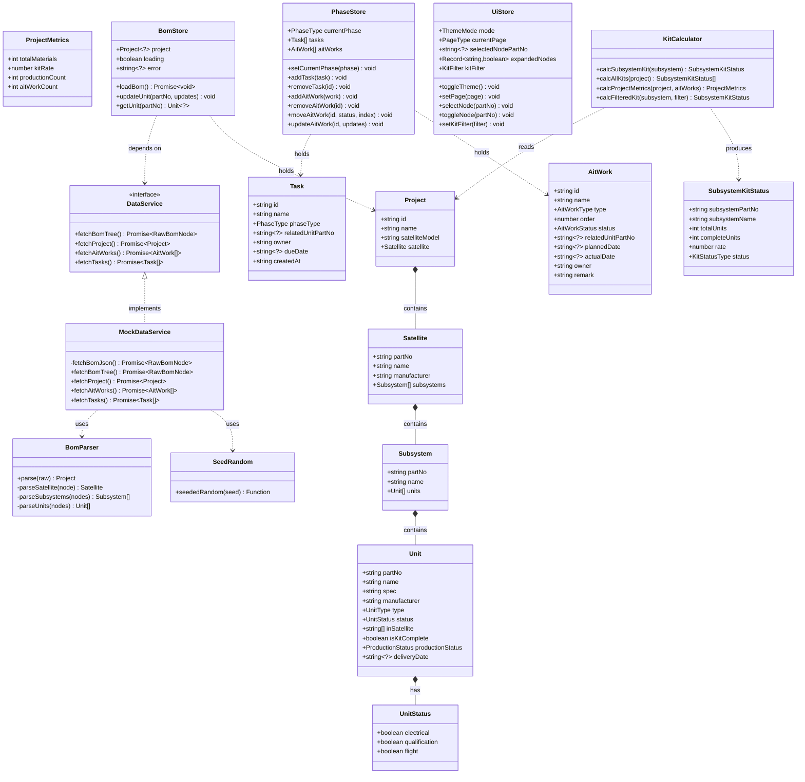
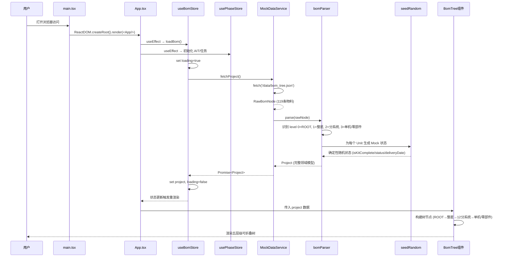
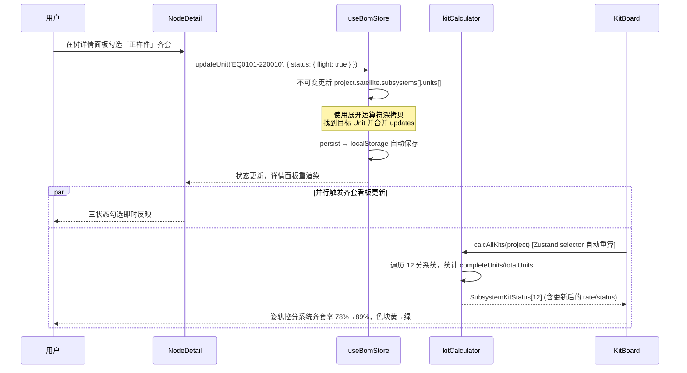
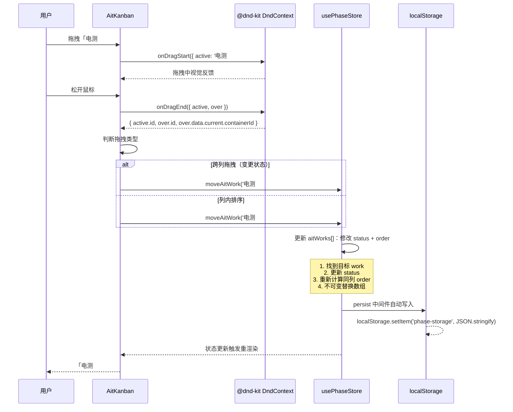
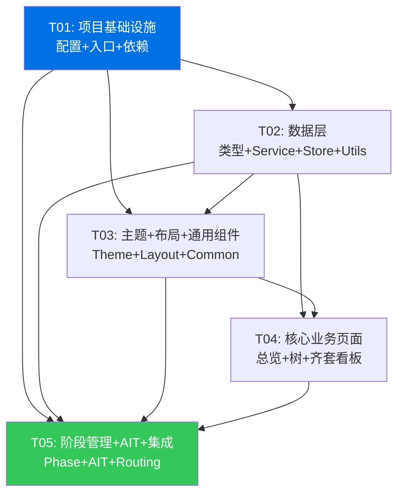

# 系统架构设计 — 卫星制造项目管理系统（Demo）

> **版本**：v1.0
> **日期**：2026-06-26
> **编写人**：高见远（架构师）
> **项目名称**：`satellite_mfg_mgmt`
> **项目根目录**：`D:\WDXTCTest`
> **依据**：PRD v1.0-draft（许清楚）、`bom_tree.json`（119 条物料）

---

## 目录

- [Part A: 系统设计](#part-a-系统设计)
  - [1. 实现方案与框架选型](#1-实现方案与框架选型)
  - [2. 文件列表](#2-文件列表)
  - [3. 数据结构与接口（类图）](#3-数据结构与接口类图)
  - [4. 程序调用流程（时序图）](#4-程序调用流程时序图)
  - [5. 待明确事项](#5-待明确事项)
- [Part B: 任务分解](#part-b-任务分解)
  - [6. 依赖包列表](#6-依赖包列表)
  - [7. 任务列表](#7-任务列表)
  - [8. 共享知识](#8-共享知识跨文件约定)
  - [9. 任务依赖图](#9-任务依赖图)

---

# Part A: 系统设计

## 1. 实现方案与框架选型

### 1.1 核心技术挑战

| # | 挑战 | 应对策略 |
|---|------|----------|
| C1 | **五层级 BOM 树渲染与交互** — 119 条物料嵌套 3-4 层，需展开/折叠/搜索/详情联动 | 基于 MUI TreeView 封装 BomTree 组件，节点数据扁平化索引（Map<partNo, Unit>）实现 O(1) 查找 |
| C2 | **齐套率实时计算与联动** — 编辑单机状态后，分系统/整星齐套率需即时更新 | 齐套率不单独存储，由 `kitCalculator.ts` 纯函数从 BOM Store 派生计算；Zustand selector 自动重算 |
| C3 | **AIT 看板拖拽** — 跨列拖拽（变更状态）+ 列内排序（调整顺序） | 使用 `@dnd-kit/core` + `@dnd-kit/sortable`，DndContext 管理全局拖拽，SortableContext 管理每列排序 |
| C4 | **苹果风格主题 + 日夜无缝切换** — MUI 默认风格偏 Material，需深度定制 | 自定义 design tokens（色板/圆角/阴影/字体），通过 `createTheme` 全量覆盖 MUI 组件样式；CSS transition 实现切换动画 |
| C5 | **多端响应式** — 桌面/平板/移动端差异化布局 | Tailwind 响应式断点 + MUI `useMediaQuery`；移动端侧边栏收为 Drawer，网格自动塌缩为单列 |
| C6 | **数据可替换性** — Demo 用 Mock，后续需对接 MES/ERP | 定义 `DataService` 接口，`MockDataService` 为唯一实现；Store 仅依赖接口，切换实现零改动 |

### 1.2 架构模式

采用 **分层架构 + 单向数据流**：

```
┌─────────────────────────────────────────────────────┐
│                    View Layer                        │
│  (React Components: Pages + Layout + Common)        │
├─────────────────────────────────────────────────────┤
│                  State Layer (Zustand)               │
│  useBomStore · usePhaseStore · useUiStore            │
├─────────────────────────────────────────────────────┤
│                  Service Layer                       │
│  DataService (interface) ← MockDataService (impl)    │
├─────────────────────────────────────────────────────┤
│                  Data Layer                          │
│  bom_tree.json → bomParser → Domain Models           │
│  + seedRandom (mock 状态生成)                         │
└─────────────────────────────────────────────────────┘
```

**数据流方向**：`bom_tree.json → MockDataService → bomParser → Zustand Store → React Components`

**编辑流方向**：`Component → Store action → 不可变更新 → selector 重算 → Component 重渲染`

### 1.3 框架与库选型

| 类别 | 选型 | 版本 | 选型理由 |
|------|------|------|----------|
| 构建工具 | Vite | ^5.3 | 快速 HMR，零配置 TypeScript 支持，适合 Demo |
| UI 框架 | React + TypeScript | ^18.3 / ^5.4 | 类型安全，生态成熟 |
| 组件库 | MUI (Material-UI) | ^5.15 | 组件丰富（TreeView/Table/Dialog/Drawer），主题定制能力强，`sx` prop 灵活覆写 |
| 原子化样式 | Tailwind CSS | ^3.4 | 快速布局/响应式/间距，与 MUI 共存（Tailwind 管布局，MUI 管组件） |
| 状态管理 | Zustand | ^4.5 | 轻量（~1KB），无 Provider 包裹，内置 `persist` 中间件支持 localStorage |
| 拖拽 | @dnd-kit | ^6.1 / ^8.0 / ^3.2 | 现代、无障碍、轻量，React 18 兼容，支持跨容器排序 |
| 图表 | Recharts | ^2.12 | 环形齐套率图/进度条，API 声明式，与 React 集成好 |
| 日期 | date-fns | ^3.6 | 轻量日期格式化（`format`/`parseISO`），tree-shakeable |
| 图标 | @mui/icons-material | ^5.15 | 与 MUI 统一风格，按需导入 |

### 1.4 关键架构决策

#### 决策 1：状态管理拆分为 3 个 Store

| Store | 职责 | 持久化 |
|-------|------|--------|
| `useBomStore` | BOM 树数据 + 单机编辑（齐套/状态/投产/交付日期） | ✅ localStorage |
| `usePhaseStore` | 阶段切换 + 临时任务 + AIT 工作项编排 | ✅ localStorage |
| `useUiStore` | 主题模式 + 当前页面 + 树展开/选中状态 + 齐套筛选 | ✅ localStorage（仅主题+页面） |

> **不单独建 KitStore**：齐套率是 BOM 数据的派生值，由 `kitCalculator.ts` 纯函数实时计算，避免双源数据不一致。

#### 决策 2：主题系统 — MUI Theme + CSS 变量双轨

```typescript
// theme/tokens.ts — 语义化设计令牌
const lightTokens = { bg: { primary: '#FFFFFF', secondary: '#F5F5F7' }, ... };
const darkTokens  = { bg: { primary: '#000000', secondary: '#1D1D1F' }, ... };

// theme/theme.ts — 映射到 MUI Theme
function createAppTheme(mode): Theme { /* createTheme + components 覆写 */ }
```

- **MUI 组件**：通过 `ThemeProvider` + `createTheme` 覆写 `palette`/`shape`/`typography`/`components`
- **Tailwind / 自定义 CSS**：通过 CSS 变量（`--bg-primary` 等）引用同一套 tokens
- **切换动画**：`* { transition: background-color 0.3s, color 0.3s, border-color 0.3s; }`

#### 决策 3：导航用状态管理而非 React Router

Demo 仅 5 个页面，无 URL 路由需求。`useUiStore.currentPage` 控制页面切换，Sidebar 点击调 `setPage()`。

> 好处：零额外依赖、状态与路由统一管理、移动端 Drawer 交互更简单。

#### 决策 4：Mock 数据用种子随机 — 可重现

```typescript
// 以 partNo 为种子生成确定性随机数
const rng = seededRandom(unit.partNo);
unit.isKitComplete = rng() > 0.3;           // 同一 partNo 永远得到同一结果
unit.status.electrical = rng() > 0.4;
```

刷新页面 → 重新加载 → 相同种子 → 相同 Mock 数据 → Demo 可重现。

#### 决策 5：DataService 接口抽象

```typescript
interface DataService {
  fetchBomTree(): Promise<RawBomNode>;
  fetchProject(): Promise<Project>;      // 解析 + 生成 Mock 状态
  fetchAitWorks(): Promise<AitWork[]>;   // 6 类预置工作
  fetchTasks(): Promise<Task[]>;         // 预置临时任务
}
```

`MockDataService` 实现该接口，从 `public/data/bom_tree.json` fetch 数据并解析。后续替换为 `ApiDataService`（对接 MES/ERP）只需实现同一接口，Store 零改动。

---

## 2. 文件列表

> 项目根目录：`D:\WDXTCTest`
> 源码根目录：`D:\WDXTCTest\src`

### 2.1 配置与入口文件

| 文件路径 | 职责 |
|----------|------|
| `package.json` | 依赖声明 + npm scripts |
| `vite.config.ts` | Vite 配置（React 插件、路径别名 `@` → `src`） |
| `tsconfig.json` | TypeScript 编译配置（strict mode、路径映射） |
| `tsconfig.node.json` | Vite 配置文件的 TS 配置 |
| `tailwind.config.ts` | Tailwind 配置（content 路径、主题扩展、暗色模式策略） |
| `postcss.config.js` | PostCSS 配置（Tailwind + Autoprefixer） |
| `index.html` | HTML 入口（挂载点、meta viewport、字体预加载） |
| `.gitignore` | Git 忽略规则 |
| `src/main.tsx` | React 入口（ReactDOM.createRoot + ThemeProvider + App） |
| `src/App.tsx` | 根组件（布局组装 + 页面路由切换 + 全局 Provider） |
| `src/vite-env.d.ts` | Vite 环境类型声明 |

### 2.2 类型定义

| 文件路径 | 职责 |
|----------|------|
| `src/types/index.ts` | 全部 TypeScript 接口/类型定义（领域模型 + 服务接口 + UI 状态） |

### 2.3 主题系统

| 文件路径 | 职责 |
|----------|------|
| `src/theme/tokens.ts` | 设计令牌：日间/夜间色板、圆角、阴影、字体栈 |
| `src/theme/theme.ts` | MUI 主题创建函数 `createAppTheme(mode)` |

### 2.4 数据服务层

| 文件路径 | 职责 |
|----------|------|
| `src/services/DataService.ts` | `DataService` 接口定义 |
| `src/services/MockDataService.ts` | Mock 实现：fetch JSON → bomParser 解析 → 种子随机生成状态 |

### 2.5 状态管理层（Zustand Stores）

| 文件路径 | 职责 |
|----------|------|
| `src/store/useBomStore.ts` | BOM 树状态：加载/查询/编辑单机 |
| `src/store/usePhaseStore.ts` | 阶段状态：当前阶段/临时任务/AIT 工作项 CRUD + 拖拽排序 |
| `src/store/useUiStore.ts` | UI 状态：主题模式/当前页面/树展开折叠/选中节点/齐套筛选 |

### 2.6 工具函数

| 文件路径 | 职责 |
|----------|------|
| `src/utils/bomParser.ts` | 将 `RawBomNode`（JSON）解析为 `Project` 领域模型 |
| `src/utils/kitCalculator.ts` | 齐套率计算纯函数：分系统级/整星级/筛选级 |
| `src/utils/seedRandom.ts` | 种子随机数生成器（mulberry32），保证 Mock 数据可重现 |

### 2.7 布局组件

| 文件路径 | 职责 |
|----------|------|
| `src/components/layout/AppLayout.tsx` | 主布局：Sidebar + Header + Content + StatusBar |
| `src/components/layout/Sidebar.tsx` | 左侧导航栏（桌面固定 / 移动端 Drawer） |
| `src/components/layout/Header.tsx` | 顶栏：项目名 + 日夜切换按钮 + 毛玻璃效果 |
| `src/components/layout/StatusBar.tsx` | 底部状态栏：物料数/齐套率/当前阶段 |

### 2.8 通用组件

| 文件路径 | 职责 |
|----------|------|
| `src/components/common/KitRingChart.tsx` | 环形齐套率图（Recharts RadialBarChart 封装） |
| `src/components/common/ProgressBar.tsx` | 进度条组件（带色块状态标识） |
| `src/components/common/StatusBadge.tsx` | 状态标签（齐套/投产/交付状态统一渲染） |

### 2.9 项目总览页

| 文件路径 | 职责 |
|----------|------|
| `src/components/dashboard/OverviewPage.tsx` | 总览页：Hero + 指标卡 + 分系统齐套缩略 + 阶段步骤条 |
| `src/components/dashboard/MetricCard.tsx` | 指标卡片（物料数/齐套率/投产数/AIT 数） |
| `src/components/dashboard/PhaseStepper.tsx` | 四阶段步骤条（设计→投产→联试→AIT） |

### 2.10 层级数据树页

| 文件路径 | 职责 |
|----------|------|
| `src/components/tree/BomTree.tsx` | 树页面容器：左树 + 右详情，响应式堆叠 |
| `src/components/tree/TreeNode.tsx` | 树节点渲染：图标/料号/品名/齐套色点，展开折叠 |
| `src/components/tree/NodeDetail.tsx` | 节点详情面板：基本信息 + 三状态勾选 + 齐套/投产/交付编辑 |

### 2.11 BOM 齐套看板页

| 文件路径 | 职责 |
|----------|------|
| `src/components/kitboard/KitBoard.tsx` | 齐套看板页：筛选栏 + 分系统卡片网格 + 下钻明细 |
| `src/components/kitboard/SubsystemCard.tsx` | 分系统卡片：名称 + 环形图 + 齐套数/总数 + 色块 |
| `src/components/kitboard/KitDetailTable.tsx` | 下钻明细表：单机列表 + 齐套状态行内编辑 |

### 2.12 阶段管理页

| 文件路径 | 职责 |
|----------|------|
| `src/components/phase/PhaseManager.tsx` | 阶段管理页：步骤条切换 + 视图路由 + 临时任务区 |
| `src/components/phase/DesignView.tsx` | 设计阶段视图：单机投产状态 + 交付日期行内编辑 |
| `src/components/phase/IntegrationView.tsx` | 联试阶段视图：正样件/电性件单机交付状态列表 |
| `src/components/phase/TaskDialog.tsx` | 临时任务新增弹窗（任务名/关联单机/负责人/截止日期） |

### 2.13 AIT 任务编排页

| 文件路径 | 职责 |
|----------|------|
| `src/components/ait/AitKanban.tsx` | AIT 看板：三列（待开始/进行中/已完成）+ DndContext |
| `src/components/ait/AitCard.tsx` | 工作卡片：可拖拽，含工作名/关联单机/计划时间/序号 |
| `src/components/ait/AitAddDialog.tsx` | 新增工作项弹窗（工作名/类型/关联单机/计划时间/负责人） |

### 2.14 静态资源

| 文件路径 | 职责 |
|----------|------|
| `public/data/bom_tree.json` | BOM 原始数据（从 `data/bom_tree.json` 复制，供 fetch 加载） |

### 2.15 完整目录树

```
D:\WDXTCTest\
├── index.html
├── package.json
├── vite.config.ts
├── tsconfig.json
├── tsconfig.node.json
├── tailwind.config.ts
├── postcss.config.js
├── .gitignore
├── data/
│   └── bom_tree.json                 ← 原始数据（只读）
├── public/
│   └── data/
│       └── bom_tree.json             ← 运行时 fetch 副本
├── docs/
│   ├── PRD.md
│   ├── ARCHITECTURE.md               ← 本文档
│   ├── class-diagram.mermaid
│   └── sequence-diagram.mermaid
└── src/
    ├── main.tsx
    ├── App.tsx
    ├── vite-env.d.ts
    ├── types/
    │   └── index.ts
    ├── theme/
    │   ├── tokens.ts
    │   └── theme.ts
    ├── services/
    │   ├── DataService.ts
    │   └── MockDataService.ts
    ├── store/
    │   ├── useBomStore.ts
    │   ├── usePhaseStore.ts
    │   └── useUiStore.ts
    ├── utils/
    │   ├── bomParser.ts
    │   ├── kitCalculator.ts
    │   └── seedRandom.ts
    ├── components/
    │   ├── layout/
    │   │   ├── AppLayout.tsx
    │   │   ├── Sidebar.tsx
    │   │   ├── Header.tsx
    │   │   └── StatusBar.tsx
    │   ├── common/
    │   │   ├── KitRingChart.tsx
    │   │   ├── ProgressBar.tsx
    │   │   └── StatusBadge.tsx
    │   ├── dashboard/
    │   │   ├── OverviewPage.tsx
    │   │   ├── MetricCard.tsx
    │   │   └── PhaseStepper.tsx
    │   ├── tree/
    │   │   ├── BomTree.tsx
    │   │   ├── TreeNode.tsx
    │   │   └── NodeDetail.tsx
    │   ├── kitboard/
    │   │   ├── KitBoard.tsx
    │   │   ├── SubsystemCard.tsx
    │   │   └── KitDetailTable.tsx
    │   ├── phase/
    │   │   ├── PhaseManager.tsx
    │   │   ├── DesignView.tsx
    │   │   ├── IntegrationView.tsx
    │   │   └── TaskDialog.tsx
    │   └── ait/
    │       ├── AitKanban.tsx
    │       ├── AitCard.tsx
    │       └── AitAddDialog.tsx
```

---

## 3. 数据结构与接口（类图）

### 3.1 TypeScript 类型定义

```typescript
// ============================================================
// src/types/index.ts — 全局类型定义
// ============================================================

// ---------- 原始 BOM JSON 节点（bom_tree.json 的结构） ----------
export interface RawBomNode {
  level: number;
  part_no: string;
  name: string;
  spec?: string;
  package?: string;
  manufacturer?: string;
  quality_level?: string;
  form?: string;
  quantity?: string;
  location?: string;
  unit?: string;
  row?: number;
  children?: RawBomNode[];
}

// ---------- 枚举/字面量类型 ----------
export type UnitType = 'equipment' | 'part';        // EQ=单机设备, PT=零部件
export type ProductionStatus = 'not_started' | 'in_progress' | 'completed';
export type PhaseType = 'design' | 'production' | 'integration' | 'ait';
export type AitWorkType =
  | 'assembly' | 'electrical_test' | 'thermal_test'
  | 'mechanical_test' | 'noise_test' | 'emc_test' | 'custom';
export type AitWorkStatus = 'pending' | 'in_progress' | 'completed';
export type KitStatusType = 'complete' | 'partial' | 'none';
export type ThemeMode = 'light' | 'dark';
export type PageType = 'overview' | 'tree' | 'kitboard' | 'phase' | 'ait';
export type KitFilter = 'all' | 'electrical' | 'qualification' | 'flight';

// ---------- 单机三状态 ----------
export interface UnitStatus {
  electrical: boolean;      // 电性件是否齐套
  qualification: boolean;   // 鉴定件是否齐套
  flight: boolean;          // 正样件是否齐套
}

// ---------- 领域模型：单机/零部件 ----------
export interface Unit {
  partNo: string;
  name: string;
  spec: string;
  manufacturer: string;
  qualityLevel: string;
  form: string;
  quantity: number;
  location: string;
  unit: string;
  type: UnitType;
  status: UnitStatus;           // 三状态齐套标记
  inSatellite: string[];        // 在整星中的状态列表，如 ['flight']
  isKitComplete: boolean;       // 整体齐套标记
  productionStatus: ProductionStatus;
  deliveryDate: string | null;  // ISO 8601 格式 'YYYY-MM-DD'
}

// ---------- 领域模型：分系统 ----------
export interface Subsystem {
  partNo: string;
  name: string;
  units: Unit[];
}

// ---------- 领域模型：整星 ----------
export interface Satellite {
  partNo: string;
  name: string;
  manufacturer: string;
  subsystems: Subsystem[];
}

// ---------- 领域模型：项目/批次 ----------
export interface Project {
  id: string;
  name: string;               // "灵犀10B"
  satelliteModel: string;
  satellite: Satellite;
}

// ---------- 阶段临时任务 ----------
export interface Task {
  id: string;
  name: string;
  phaseType: PhaseType;
  relatedUnitPartNo: string | null;
  owner: string;
  dueDate: string | null;      // 'YYYY-MM-DD'
  createdAt: string;           // ISO 8601 datetime
}

// ---------- AIT 工作项 ----------
export interface AitWork {
  id: string;
  name: string;
  type: AitWorkType;
  order: number;               // 全局排序序号
  status: AitWorkStatus;
  relatedUnitPartNo: string | null;
  plannedDate: string | null;  // 'YYYY-MM-DD'
  actualDate: string | null;
  owner: string;
  remark: string;
}

// ---------- 计算类型：分系统齐套状态 ----------
export interface SubsystemKitStatus {
  subsystemPartNo: string;
  subsystemName: string;
  totalUnits: number;
  completeUnits: number;
  rate: number;                // 0-100
  status: KitStatusType;
}

// ---------- 计算类型：项目总览指标 ----------
export interface ProjectMetrics {
  totalMaterials: number;
  kitRate: number;             // 0-100
  productionCount: number;
  aitWorkCount: number;
}

// ---------- 服务接口 ----------
export interface DataService {
  fetchBomTree(): Promise<RawBomNode>;
  fetchProject(): Promise<Project>;
  fetchAitWorks(): Promise<AitWork[]>;
  fetchTasks(): Promise<Task[]>;
}

// ---------- AIT 预置工作类型映射 ----------
export const AIT_WORK_PRESETS: Record<AitWorkType, string> = {
  assembly: '总装',
  electrical_test: '电测',
  thermal_test: '热试验',
  mechanical_test: '力学试验',
  noise_test: '噪声试验',
  emc_test: 'EMC试验',
  custom: '自定义',
};

// ---------- 阶段标签映射 ----------
export const PHASE_LABELS: Record<PhaseType, string> = {
  design: '设计阶段',
  production: '投产阶段',
  integration: '联试阶段',
  ait: 'AIT阶段',
};
```

### 3.2 类图（Mermaid）



> 完整类图同时保存至 `docs/class-diagram.mermaid`

---

## 4. 程序调用流程（时序图）

### 4.1 流程一：应用启动 → 加载 BOM → 渲染树



### 4.2 流程二：用户编辑单机状态 → 更新齐套看板



### 4.3 流程三：AIT 拖拽排序 → 持久化



> 完整时序图同时保存至 `docs/sequence-diagram.mermaid`

---

## 5. 待明确事项

| # | 待明确问题 | 当前假设 | 影响范围 | 建议确认方 |
|---|-----------|----------|----------|-----------|
| A1 | **投产阶段视图内容** — PRD Q5 提到用户未明确投产阶段关注点 | Demo 投产阶段展示「已投产单机的生产进度跟踪」（生产状态 + 预计完成时间），复用设计阶段数据 | `DesignView` 逻辑可复用，`PhaseManager` 路由 | 产品经理/用户 |
| A2 | **PT 零部件在三状态管理中的处理** — PRD Q8 提到 67 条 PT 零部件 | PT 零部件纳入分系统齐套统计（计入 totalUnits），但不做三状态管理（仅 EQ 单机有三状态）；PT 的 `type` 标记为 `'part'`，UI 隐藏三状态勾选区 | `bomParser`、`NodeDetail`、`KitDetailTable` | 产品经理 |
| A3 | **AIT 工作与单机关联范围** — PRD Q6 提到 AIT 工作是否关联单机 | 总装(assembly)关联整星(null)；电测(electrical_test)可关联具体单机或分系统；其他试验类默认关联整星。Demo 预置数据中电测关联 SMU | `AitWork.relatedUnitPartNo`、`AitCard` | 产品经理/用户 |
| A4 | **元器件层级占位方式** — PRD Q2 提到 BOM 无元器件数据 | EQ 单机下显示「暂无元器件数据」占位子节点（不可展开），树视觉上保持五层级概念 | `TreeNode` | 产品经理 |
| A5 | **数据重置机制** — Demo 编辑后如何恢复初始 Mock 数据 | 提供「重置数据」按钮（隐藏在 Header 设置菜单中），清除 localStorage 并重新 `loadBom()` | `useBomStore`、`Header` | 架构师决定，Demo 可选 |
| A6 | **齐套率计算口径** — 分系统齐套率是否区分三状态维度 | 默认按 `isKitComplete`（整体齐套）计算；筛选电性件/鉴定件/正样件时，按对应 `status.electrical/qualification/flight` 字段重新计算 | `kitCalculator` | 产品经理 |

---

# Part B: 任务分解

## 6. 依赖包列表

### 6.1 dependencies（运行时依赖）

| 包名 | 版本 | 用途 |
|------|------|------|
| `react` | ^18.3.1 | UI 框架 |
| `react-dom` | ^18.3.1 | React DOM 渲染 |
| `@mui/material` | ^5.15.20 | 组件库（TreeView/Table/Dialog/Drawer/Card 等） |
| `@mui/icons-material` | ^5.15.20 | 图标库 |
| `@emotion/react` | ^11.11.4 | MUI 样式引擎依赖 |
| `@emotion/styled` | ^11.11.5 | MUI 样式引擎依赖 |
| `zustand` | ^4.5.2 | 状态管理（含 persist 中间件） |
| `recharts` | ^2.12.7 | 齐套率环形图/进度条图表 |
| `@dnd-kit/core` | ^6.1.0 | AIT 看板拖拽核心 |
| `@dnd-kit/sortable` | ^8.0.0 | AIT 看板列内排序 |
| `@dnd-kit/utilities` | ^3.2.2 | dnd-kit 工具函数（CSS transform） |
| `date-fns` | ^3.6.0 | 日期格式化（format/parseISO） |

### 6.2 devDependencies（开发依赖）

| 包名 | 版本 | 用途 |
|------|------|------|
| `typescript` | ^5.4.5 | TypeScript 编译器 |
| `vite` | ^5.3.1 | 构建工具 + 开发服务器 |
| `@vitejs/plugin-react` | ^4.3.1 | Vite React 插件 |
| `tailwindcss` | ^3.4.4 | 原子化 CSS |
| `postcss` | ^8.4.38 | CSS 后处理器 |
| `autoprefixer` | ^10.4.19 | PostCSS 自动前缀 |
| `@types/react` | ^18.3.3 | React 类型声明 |
| `@types/react-dom` | ^18.3.0 | React DOM 类型声明 |

### 6.3 package.json scripts

```json
{
  "scripts": {
    "dev": "vite",
    "build": "tsc && vite build",
    "preview": "vite preview",
    "lint": "tsc --noEmit"
  }
}
```

---

## 7. 任务列表

> **分组原则**：按功能模块/层次分组，每任务含 3+ 相关文件，最多 5 个任务。
> **优先级**：P0 = Demo 必须 / P1 = Demo 增强

### T01：项目基础设施（配置 + 入口 + 依赖声明）

| 字段 | 内容 |
|------|------|
| **任务 ID** | T01 |
| **任务名称** | 项目基础设施搭建 |
| **优先级** | P0 |
| **依赖** | 无 |
| **涉及文件** | `package.json`, `vite.config.ts`, `tsconfig.json`, `tsconfig.node.json`, `tailwind.config.ts`, `postcss.config.js`, `index.html`, `.gitignore`, `src/main.tsx`, `src/App.tsx`, `src/vite-env.d.ts`, `public/data/bom_tree.json` |

**实现要点**：

1. **package.json**：声明上述全部 dependencies + devDependencies；scripts 含 dev/build/preview/lint
2. **vite.config.ts**：配置 `@vitejs/plugin-react`；路径别名 `{ '@': resolve(__dirname, 'src') }`；server.port 设为 5173
3. **tsconfig.json**：`strict: true`，`jsx: react-jsx`，paths 映射 `@/* → src/*`，`target: ES2020`
4. **tailwind.config.ts**：`content: ['./index.html', './src/**/*.{ts,tsx}']`；`darkMode: 'class'`；theme.extend 中添加 Apple 风格圆角（`12px`/`16px`）和字体栈
5. **postcss.config.js**：`tailwindcss` + `autoprefixer`
6. **index.html**：`<div id="root">`；viewport meta 含 `width=device-width, initial-scale=1.0`；预加载 Inter 字体（Google Fonts）+ PingFang SC 系统字体
7. **src/main.tsx**：`ReactDOM.createRoot(document.getElementById('root')!).render(<App />)`；包裹 `<ThemeProvider>` + `<CssBaseline>`
8. **src/App.tsx**：最小骨架 — 读取 `useUiStore.mode` 创建主题，渲染 `<AppLayout>`；AppLayout 内暂时只显示 "灵犀10B 卫星制造管理系统" 占位文字
9. **src/vite-env.d.ts**：`/// <reference types="vite/client" />`
10. **public/data/bom_tree.json**：从 `D:\WDXTCTest\data\bom_tree.json` 复制

**验收标准**：
- [ ] `npm install` 无报错
- [ ] `npm run dev` 启动后浏览器显示占位标题
- [ ] `npm run build` 编译通过（tsc 无类型错误）
- [ ] 路径别名 `@/` 可正常导入
- [ ] Tailwind 工具类生效（如 `className="text-center"` 居中）

---

### T02：数据层（类型定义 + 服务层 + 状态管理 + 工具函数）

| 字段 | 内容 |
|------|------|
| **任务 ID** | T02 |
| **任务名称** | 数据层实现（类型 + Service + Store + Utils） |
| **优先级** | P0 |
| **依赖** | T01 |
| **涉及文件** | `src/types/index.ts`, `src/services/DataService.ts`, `src/services/MockDataService.ts`, `src/store/useBomStore.ts`, `src/store/usePhaseStore.ts`, `src/store/useUiStore.ts`, `src/utils/bomParser.ts`, `src/utils/kitCalculator.ts`, `src/utils/seedRandom.ts` |

**实现要点**：

#### 2.1 `src/types/index.ts`
- 完整复制第 3.1 节的全部 TypeScript 类型定义
- 确保 `RawBomNode` 字段与 `bom_tree.json` 完全对应（注意 `package` 字段名避免与 JS 关键字冲突，JSON 中是 `package`，接口中也用 `package`）

#### 2.2 `src/utils/seedRandom.ts`
```typescript
// mulberry32 算法实现确定性 PRNG
export function seededRandom(seed: string): () => number {
  let hash = 0;
  for (let i = 0; i < seed.length; i++) {
    hash = ((hash << 5) - hash) + seed.charCodeAt(i);
    hash |= 0;
  }
  let state = hash >>> 0;
  return () => {
    state |= 0; state = (state + 0x6D2B79F5) | 0;
    let t = Math.imul(state ^ (state >>> 15), 1 | state);
    t = (t + Math.imul(t ^ (t >>> 7), 61 | t)) ^ t;
    return ((t ^ (t >>> 14)) >>> 0) / 4294967296;
  };
}
```

#### 2.3 `src/utils/bomParser.ts`
- `parseBomTree(raw: RawBomNode): Project`
- level 0 → Project（name 取 raw.name = "灵犀10B"）
- level 1 (ST01) → Satellite
- level 2 (SB*) → Subsystem[]
- level 3 (EQ*/PT*) → Unit[]
- 对每个 Unit：
  - `type`: partNo 以 `EQ` 开头 → `'equipment'`，`PT` 开头 → `'part'`
  - 用 `seededRandom(partNo)` 生成确定性 Mock 状态：`isKitComplete`、`status.electrical/qualification/flight`、`productionStatus`、`deliveryDate`（随机 2026-07 ~ 2026-10 范围内日期）
  - `inSatellite`: 随机选 1-2 个状态
  - PT 零部件的 `status` 全部设为 `{ electrical: false, qualification: false, flight: false }`，`isKitComplete` 仍随机生成

#### 2.4 `src/utils/kitCalculator.ts`
- `calcSubsystemKit(subsystem: Subsystem, filter?: KitFilter): SubsystemKitStatus`
  - 无 filter：统计 `units.filter(u => u.isKitComplete).length / units.length`
  - filter='electrical'：统计 `units.filter(u => u.status.electrical).length / units.length`
  - 同理 qualification/flight
  - rate = Math.round(complete / total * 100)
  - status: rate=100 → 'complete'，rate>0 → 'partial'，rate=0 → 'none'
- `calcAllKits(project: Project, filter?: KitFilter): SubsystemKitStatus[]`
- `calcProjectMetrics(project: Project, aitWorks: AitWork[]): ProjectMetrics`
  - totalMaterials = 所有 Unit 数量
  - kitRate = 整体 isKitComplete 率
  - productionCount = productionStatus !== 'not_started' 的数量
  - aitWorkCount = aitWorks.length

#### 2.5 `src/services/DataService.ts`
- 导出 `DataService` 接口（见类型定义）

#### 2.6 `src/services/MockDataService.ts`
- `fetchBomTree()`: `fetch('/data/bom_tree.json').then(r => r.json())`
- `fetchProject()`: fetchBomTree → bomParser.parseBomTree → return Project
- `fetchAitWorks()`: 返回 6 类预置工作，初始状态分散（2个pending, 1个in_progress, 3个completed），order 按状态列内排序
- `fetchTasks()`: 返回 2 条预置临时任务（设计阶段）

#### 2.7 `src/store/useBomStore.ts`
```typescript
// 使用 Zustand + persist 中间件
interface BomState {
  project: Project | null;
  loading: boolean;
  error: string | null;
  loadBom: () => Promise<void>;
  updateUnit: (partNo: string, updates: Partial<Unit>) => void;
  getUnit: (partNo: string) => Unit | undefined;
  resetData: () => Promise<void>;
}
// persist: { name: 'bom-storage', partialize: (s) => ({ project: s.project }) }
// loadBom: 调用 MockDataService.fetchProject()，若 localStorage 已有则跳过
// updateUnit: 不可变更新（深拷贝到目标 Unit 所在路径，合并 updates）
// getUnit: 遍历 project.satellite.subsystems[].units[] 查找
```

#### 2.8 `src/store/usePhaseStore.ts`
```typescript
interface PhaseState {
  currentPhase: PhaseType;
  tasks: Task[];
  aitWorks: AitWork[];
  setCurrentPhase: (phase: PhaseType) => void;
  addTask: (task: Omit<Task, 'id'>) => void;
  removeTask: (taskId: string) => void;
  addAitWork: (work: Omit<AitWork, 'id'>) => void;
  removeAitWork: (workId: string) => void;
  moveAitWork: (workId: string, toStatus: AitWorkStatus, toIndex: number) => void;
  updateAitWork: (workId: string, updates: Partial<AitWork>) => void;
}
// persist: { name: 'phase-storage' }
// moveAitWork: 1.找到work 2.更新status 3.同列重新排序(order从0开始) 4.不可变替换
```

#### 2.9 `src/store/useUiStore.ts`
```typescript
interface UiState {
  mode: ThemeMode;
  currentPage: PageType;
  selectedNodePartNo: string | null;
  expandedNodes: Record<string, boolean>;
  kitFilter: KitFilter;
  toggleTheme: () => void;
  setPage: (page: PageType) => void;
  selectNode: (partNo: string | null) => void;
  toggleNode: (partNo: string) => void;
  setKitFilter: (filter: KitFilter) => void;
}
// persist: { name: 'ui-storage', partialize: (s) => ({ mode: s.mode, currentPage: s.currentPage }) }
// 初始 mode: 'light'，初始 currentPage: 'overview'
```

**验收标准**：
- [ ] `MockDataService.fetchProject()` 返回包含 12 分系统、39 单机、67 零部件的 Project 对象
- [ ] 相同 partNo 多次调用 `seededRandom` 结果一致
- [ ] `kitCalculator.calcAllKits()` 返回 12 条 SubsystemKitStatus
- [ ] `useBomStore.updateUnit()` 后 `getUnit()` 返回更新后的值
- [ ] localStorage 中可见 `bom-storage`、`phase-storage`、`ui-storage` 键
- [ ] `npm run build` 类型检查通过

---

### T03：主题系统 + 布局 + 通用组件

| 字段 | 内容 |
|------|------|
| **任务 ID** | T03 |
| **任务名称** | 主题系统与布局组件 |
| **优先级** | P0 |
| **依赖** | T01, T02 |
| **涉及文件** | `src/theme/tokens.ts`, `src/theme/theme.ts`, `src/components/layout/AppLayout.tsx`, `src/components/layout/Sidebar.tsx`, `src/components/layout/Header.tsx`, `src/components/layout/StatusBar.tsx`, `src/components/common/KitRingChart.tsx`, `src/components/common/ProgressBar.tsx`, `src/components/common/StatusBadge.tsx` |

**实现要点**：

#### 3.1 `src/theme/tokens.ts`
- 定义 `lightTokens` 和 `darkTokens` 对象，包含 PRD 6.7 节的日夜色板：
  - `bg.primary`, `bg.secondary`, `card`, `text.primary`, `text.secondary`
  - `accent`, `success`, `warning`, `error`
  - `border`, `shadow`（`0 2px 12px rgba(0,0,0,0.06)` / `0 2px 12px rgba(0,0,0,0.3)`）
  - `radius`（card: 16px, button: 12px）
  - `fontFamily`（`'Inter', 'PingFang SC', -apple-system, BlinkMacSystemFont, 'Segoe UI', sans-serif`）
- 同时导出 CSS 变量字符串，注入到 `:root` / `.dark`

#### 3.2 `src/theme/theme.ts`
- `createAppTheme(mode: ThemeMode): Theme`
- 映射 tokens 到 MUI `createTheme`：
  - `palette.mode`、`palette.primary.main`、`palette.success/warning/error`
  - `palette.background.default/paper`
  - `palette.text.primary/secondary`
  - `shape.borderRadius: 12`
  - `typography.fontFamily`、`typography.h4/h5/h6/button/body2` 字号字重
  - `components` 覆写：
    - `MuiCard`: `{ borderRadius: 16, boxShadow: tokens.shadow, border: 1px solid tokens.border }`
    - `MuiPaper`: `{ backgroundImage: 'none' }`（去除默认渐变）
    - `MuiButton`: `{ borderRadius: 12, textTransform: 'none', fontWeight: 500 }`
    - `MuiAppBar`: `{ backgroundColor: 半透明+毛玻璃 backdropFilter: 'blur(20px)' }`
    - `MuiTableCell`: `{ borderBottom: 1px solid tokens.border }`
    - `MuiDialog`: `{ borderRadius: 16 }`

#### 3.3 `src/components/layout/AppLayout.tsx`
- 结构：`<Box sx={{ display: 'flex', flexDirection: 'column', minHeight: '100vh' }}>`
  - `<Header />` (sticky top)
  - `<Box sx={{ display: 'flex', flex: 1 }}>`
    - `<Sidebar />` (桌面端固定宽度 240px，移动端 Drawer)
    - `<Box component="main" sx={{ flex: 1, p: { xs: 2, md: 4 } }}>` → 根据 `currentPage` 渲染对应页面组件（T03 阶段渲染占位文字）
  - `<StatusBar />`
- 使用 `useMediaQuery('(min-width:768px)')` 判断桌面/移动

#### 3.4 `src/components/layout/Sidebar.tsx`
- 5 个导航项：📊 总览 / 🌳 层级数据 / ✅ BOM齐套 / 📋 阶段管理 / ⚙️ AIT编排
- 每项使用 MUI `ListItemButton`，点击调 `useUiStore.setPage()`
- 当前页面高亮（`selected` 状态）
- 桌面端：固定左侧 `<Drawer variant="permanent">`
- 移动端：`<Drawer variant="temporary" open={mobileOpen}>`，Header 汉堡按钮控制

#### 3.5 `src/components/layout/Header.tsx`
- 左侧：汉堡菜单按钮（移动端）+ 项目名 "灵犀10B 卫星制造管理系统"
- 右侧：日夜切换按钮（`IconButton` + `LightMode`/`DarkMode` 图标），点击调 `toggleTheme()`
- `position: sticky`，`backdropFilter: 'blur(20px)'`，背景半透明
- 可选：设置菜单（含「重置数据」入口，调 `useBomStore.resetData()`）

#### 3.6 `src/components/layout/StatusBar.tsx`
- 底部固定栏，显示：项目名 · 物料总数 · 齐套率 · 当前阶段
- 从 `useBomStore.project` + `usePhaseStore.currentPhase` 读取数据
- 使用 `kitCalculator.calcProjectMetrics()` 计算齐套率
- 移动端隐藏或简化为一行

#### 3.7 `src/components/common/KitRingChart.tsx`
- Props: `{ rate: number; size?: number; status: KitStatusType }`
- 使用 Recharts `RadialBarChart` 或自绘 SVG 环形图
- 颜色映射：complete → success 色, partial → warning 色, none → error 色
- 中心显示百分比文字

#### 3.8 `src/components/common/ProgressBar.tsx`
- Props: `{ value: number; status: KitStatusType; height?: number }`
- MUI `LinearProgress` 或自绘 div
- 背景色 + 进度色根据 status 映射
- 圆角两端

#### 3.9 `src/components/common/StatusBadge.tsx`
- Props: `{ type: 'kit' | 'production' | 'delivery' | 'ait'; value: string; }`
- 根据类型+值渲染对应色块标签（如 kit+complete → 绿色"已齐套"）
- 使用 MUI `Chip` 组件，自定义颜色

**验收标准**：
- [ ] 日夜切换按钮点击后，全站配色平滑过渡（0.3s 动画），无闪烁
- [ ] Sidebar 导航点击后主内容区切换（T03 阶段显示占位文字即可）
- [ ] Header 毛玻璃效果在桌面端可见
- [ ] 移动端（<768px）Sidebar 收为 Drawer，汉堡按钮可开关
- [ ] StatusBar 正确显示物料总数和齐套率
- [ ] KitRingChart 环形图正确渲染百分比和颜色
- [ ] `npm run build` 通过

---

### T04：核心业务页面（总览 + 层级树 + 齐套看板）

| 字段 | 内容 |
|------|------|
| **任务 ID** | T04 |
| **任务名称** | 核心业务页面实现（总览 + 树 + 齐套看板） |
| **优先级** | P0 |
| **依赖** | T01, T02, T03 |
| **涉及文件** | `src/components/dashboard/OverviewPage.tsx`, `src/components/dashboard/MetricCard.tsx`, `src/components/dashboard/PhaseStepper.tsx`, `src/components/tree/BomTree.tsx`, `src/components/tree/TreeNode.tsx`, `src/components/tree/NodeDetail.tsx`, `src/components/kitboard/KitBoard.tsx`, `src/components/kitboard/SubsystemCard.tsx`, `src/components/kitboard/KitDetailTable.tsx` |

**实现要点**：

#### 4.1 `src/components/dashboard/OverviewPage.tsx`
- **Hero 区**：项目名称 + 卫星型号 + 整体进度环形图（4 阶段完成度，当前阶段及之前=已完成）
- **指标卡区**：4 张 `<MetricCard>` 横排（`grid grid-cols-2 md:grid-cols-4 gap-4`）
  - 物料总数 / 齐套率 / 已投产单机数 / AIT 工作项数
  - 数据来自 `kitCalculator.calcProjectMetrics(project, aitWorks)`
- **分系统齐套缩略**：12 个分系统小型 `<ProgressBar>` 横排，点击跳转齐套看板（`setPage('kitboard')`）
- **阶段步骤条**：`<PhaseStepper currentPhase={currentPhase} onNavigate={setPage('phase')} />`
- 移动端：指标卡 2×2 网格，进度条单列

#### 4.2 `src/components/dashboard/MetricCard.tsx`
- Props: `{ label: string; value: string | number; icon: ReactNode; color?: string }`
- 苹果风格卡片：圆角 16px，微妙阴影，大号数字 + 小号标签
- hover 轻微上浮（`transform: translateY(-2px)`）

#### 4.3 `src/components/dashboard/PhaseStepper.tsx`
- Props: `{ currentPhase: PhaseType; onNavigate?: () => void }`
- MUI `Stepper` + `Step`，4 个步骤：设计 → 投产 → 联试 → AIT
- 当前阶段高亮（加粗 + 强调色），已完成阶段打勾
- 点击步骤调 `usePhaseStore.setCurrentPhase()` + `onNavigate()`
- 移动端：横向滚动

#### 4.4 `src/components/tree/BomTree.tsx`
- 布局：`<Box sx={{ display: 'flex', gap: 2 }}>`
  - 左侧树（`flex: 0 0 320px` / 移动端 `flex: 1`）
  - 右侧详情 `<NodeDetail>`（`flex: 1` / 移动端在树下方）
- 移动端：`flexDirection: 'column'`，树在上详情在下
- 顶部搜索框：`<TextField>` 输入料号/品名，过滤树节点并自动展开匹配项父级
- 树数据来自 `useBomStore.project`

#### 4.5 `src/components/tree/TreeNode.tsx`
- 递归渲染树节点
- 每级图标：🛰️ 整星 / 📦 分系统 / 🔧 单机(EQ) / ⚡ 零部件(PT) / 🔩 元器件(占位)
- 节点显示：料号 + 品名 + 齐套色点（绿/黄/红 6px 圆点）
- 展开/折叠：调 `useUiStore.toggleNode(partNo)`
- 点击节点：调 `useUiStore.selectNode(partNo)`
- 选中状态：背景高亮
- 元器件层级（EQ 下）：显示 "暂无元器件数据" 占位子节点

#### 4.6 `src/components/tree/NodeDetail.tsx`
- 从 `useBomStore.getUnit(selectedNodePartNo)` 获取选中节点
- **基本信息区**：料号/品名/规格/厂家/质量等级/用量/位号 — 只读展示
- **三状态区**（仅 EQ 单机显示）：
  - 三个 `Checkbox`：电性件/鉴定件/正样件，勾选=齐套
  - 每个 checkbox 旁有「在整星中」标签可切换
  - 勾选变更调 `useBomStore.updateUnit(partNo, { status: {...} })`
- **齐套标记**：`<StatusBadge type="kit" />` 显示整体齐套状态
- **投产状态**：下拉选择（未投产/生产中/已完成），调 `updateUnit(partNo, { productionStatus })`
- **交付日期**：`<DatePicker>` 或 `<TextField type="date">`，调 `updateUnit(partNo, { deliveryDate })`
- 分系统/整星节点选中时：显示统计信息（下属单机数/齐套率）

#### 4.7 `src/components/kitboard/KitBoard.tsx`
- **顶部筛选栏**：
  - 状态筛选 `<ToggleButtonGroup>`：全部/电性件/鉴定件/正样件 → `useUiStore.setKitFilter()`
  - 搜索框 `<TextField>`（按料号/品名过滤分系统卡片）
- **分系统卡片网格**：`grid grid-cols-1 md:grid-cols-2 lg:grid-cols-3 xl:grid-cols-4 gap-4`
- **下钻明细**：点击卡片展开 `<KitDetailTable>`（Collapse 或 Dialog）

#### 4.8 `src/components/kitboard/SubsystemCard.tsx`
- Props: `{ subsystem: Subsystem; filter: KitFilter; onClick: () => void }`
- 内容：分系统名 + `<KitRingChart rate={kitStatus.rate} />` + "8/9" 文字 + `<ProgressBar>`
- 使用 `kitCalculator.calcSubsystemKit(subsystem, filter)` 计算筛选后的齐套率
- 卡片可点击（下钻），hover 阴影加深

#### 4.9 `src/components/kitboard/KitDetailTable.tsx`
- Props: `{ subsystem: Subsystem; filter: KitFilter }`
- MUI `Table` 展示该分系统下所有 Unit：
  - 列：料号 / 品名 / 类型 / 电性件 / 鉴定件 / 正样件 / 整体齐套 / 投产状态 / 交付日期
  - 三状态列为 `Checkbox`，可编辑（调 `useBomStore.updateUnit`）
  - 整体齐套列用 `<StatusBadge>`
  - 搜索过滤：按料号/品名匹配

**验收标准**：
- [ ] 总览页显示 4 张指标卡，数值正确（物料 119 / 齐套率 ~68% / 投产数 / AIT 数 6）
- [ ] 12 个分系统进度条横排显示，点击跳转齐套看板
- [ ] 阶段步骤条高亮当前阶段，可点击切换
- [ ] 层级树展示 5 层级，可展开/折叠，节点显示料号+品名+齐套色点
- [ ] 点击树节点后右侧详情面板显示对应信息
- [ ] EQ 单机详情面板可勾选三状态，勾选后齐套色点即时变化
- [ ] 齐套看板 12 张分系统卡片正确显示环形图和齐套率
- [ ] 三状态筛选切换后，卡片齐套率重新计算
- [ ] 点击卡片可展开单机明细表，表中可编辑齐套状态
- [ ] 移动端布局自适应（卡片单列，树/详情堆叠）
- [ ] `npm run build` 通过

---

### T05：阶段管理 + AIT 编排 + 全局集成

| 字段 | 内容 |
|------|------|
| **任务 ID** | T05 |
| **任务名称** | 阶段管理 + AIT 拖拽看板 + 全局集成调试 |
| **优先级** | P0 |
| **依赖** | T01, T02, T03, T04 |
| **涉及文件** | `src/components/phase/PhaseManager.tsx`, `src/components/phase/DesignView.tsx`, `src/components/phase/IntegrationView.tsx`, `src/components/phase/TaskDialog.tsx`, `src/components/ait/AitKanban.tsx`, `src/components/ait/AitCard.tsx`, `src/components/ait/AitAddDialog.tsx`, `src/App.tsx`（更新：接入全部页面 + 全局 useEffect 初始化） |

**实现要点**：

#### 5.1 `src/components/phase/PhaseManager.tsx`
- **顶部步骤条**：复用 `<PhaseStepper>`，点击切换 `usePhaseStore.setCurrentPhase()`
- **阶段内容区**：根据 `currentPhase` 路由：
  - `design` → `<DesignView>`
  - `production` → `<DesignView>`（复用，显示已投产单机的生产进度，列稍有不同）
  - `integration` → `<IntegrationView>`
  - `ait` → 跳转 AIT 看板：`useUiStore.setPage('ait')`
- **临时任务区**：底部展示当前阶段的 Task 列表 + 「+ 添加任务」按钮 → 打开 `<TaskDialog>`

#### 5.2 `src/components/phase/DesignView.tsx`
- Props: `{ variant?: 'design' | 'production' }`
- **设计阶段**：MUI `Table` 展示所有 EQ 单机
  - 列：料号 / 品名 / 分系统 / 是否投产（`Select` 行内编辑）/ 交付日期（`TextField type="date"` 行内编辑）
  - 投产状态变更调 `useBomStore.updateUnit(partNo, { productionStatus })`
  - 日期变更调 `useBomStore.updateUnit(partNo, { deliveryDate })`
- **投产阶段**（variant='production'）：筛选 `productionStatus !== 'not_started'` 的单机
  - 列：料号 / 品名 / 生产状态 / 预计完成时间（=deliveryDate）
- 移动端：表格转为卡片列表

#### 5.3 `src/components/phase/IntegrationView.tsx`
- 筛选条件：`status.flight === true || status.electrical === true` 的单机
- MUI `Table` 列：料号 / 品名 / 分系统 / 正样件状态 / 电性件状态 / 交付状态 / 交付日期
- 交付状态逻辑：有 deliveryDate 且 < 今天 → "已交付"；有日期且 ≥ 今天 → "待交付"；无日期 → "未安排"
- 正样件/电性件状态：有对应 status → "✅ 齐套"；无 → "—"

#### 5.4 `src/components/phase/TaskDialog.tsx`
- MUI `Dialog` 弹窗
- 表单字段：任务名称（必填）/ 关联单机（可选，下拉选 EQ 单机）/ 负责人 / 截止日期
- 提交调 `usePhaseStore.addTask({ name, phaseType: currentPhase, relatedUnitPartNo, owner, dueDate, createdAt: new Date().toISOString() })`
- 取消关闭弹窗

#### 5.5 `src/components/ait/AitKanban.tsx`
- **三列看板**：待开始(pending) / 进行中(in_progress) / 已完成(completed)
- **@dnd-kit 集成**：
  - `<DndContext onDragEnd={handleDragEnd} onDragStart={handleDragStart}>`
  - 每列用 `<SortableContext items={workIds} strategy={verticalListSortingStrategy}>`
  - `handleDragEnd`: 解析 `active.id` 和 `over.id`，判断同列排序还是跨列移动，调 `usePhaseStore.moveAitWork(workId, toStatus, toIndex)`
- **新增按钮**：底部「+ 新增工作项」→ 打开 `<AitAddDialog>`
- 列标题显示计数：`待开始 (3)`
- 移动端：三列改为水平滚动或 Tab 切换

#### 5.6 `src/components/ait/AitCard.tsx`
- Props: `{ work: AitWork }`
- 使用 `useSortable({ id: work.id })` 实现拖拽
- 卡片内容：序号 + 工作名 + 关联单机名 + 计划时间 + 状态色条
- 拖拽时 `opacity: 0.5` + 阴影
- 卡片右上角可展开详情（关联单机/实际时间/负责人/备注）— 可选 P1
- 点击删除按钮调 `usePhaseStore.removeAitWork(work.id)`

#### 5.7 `src/components/ait/AitAddDialog.tsx`
- MUI `Dialog`
- 表单字段：工作名称 / 类型（下拉：6 类预置 + 自定义）/ 关联单机（可选）/ 计划时间 / 负责人 / 备注
- 提交调 `usePhaseStore.addAitWork({ name, type, order: 最大order+1, status: 'pending', ... })`
- 新增工作默认放入「待开始」列末尾

#### 5.8 `src/App.tsx`（更新）
- **全局初始化 useEffect**：
  ```typescript
  useEffect(() => {
    useBomStore.getState().loadBom();
    // PhaseStore 初始化在 persist 恢复或首次加载时由 MockDataService 提供
  }, []);
  ```
- **页面路由**：根据 `useUiStore.currentPage` 渲染：
  - `overview` → `<OverviewPage>`
  - `tree` → `<BomTree>`
  - `kitboard` → `<KitBoard>`
  - `phase` → `<PhaseManager>`
  - `ait` → `<AitKanban>`
- **Loading 状态**：`useBomStore.loading` 为 true 时显示全屏 `<CircularProgress>`
- **Error 状态**：`useBomStore.error` 非空时显示错误提示 + 重试按钮

**验收标准**：
- [ ] 阶段步骤条可切换四个阶段，视图内容随阶段变化
- [ ] 设计阶段表格可行内编辑投产状态和交付日期
- [ ] 联试阶段自动筛选出含正样件/电性件的单机
- [ ] 可添加临时任务，任务出现在对应阶段的任务区
- [ ] AIT 看板三列显示 6 类预置工作
- [ ] 工作卡片可同列拖拽排序，顺序即时更新
- [ ] 工作卡片可跨列拖拽变更状态
- [ ] 可新增自定义工作项，出现在「待开始」列
- [ ] 可删除工作项
- [ ] 所有编辑操作刷新页面后数据保留（localStorage 持久化）
- [ ] 移动端 AIT 看板可用（水平滚动或 Tab 切换）
- [ ] `npm run build` 通过，全站功能可用

---

## 8. 共享知识（跨文件约定）

### 8.1 命名规范

| 类别 | 规范 | 示例 |
|------|------|------|
| 文件名 | PascalCase（组件）/ camelCase（工具/服务/store） | `OverviewPage.tsx`, `bomParser.ts`, `useBomStore.ts` |
| 组件名 | PascalCase | `OverviewPage`, `SubsystemCard` |
| 函数名 | camelCase | `loadBom()`, `calcSubsystemKit()` |
| 类型/接口 | PascalCase | `Project`, `DataService`, `UnitStatus` |
| 常量 | UPPER_SNAKE_CASE | `AIT_WORK_PRESETS`, `PHASE_LABELS` |
| Store hook | `use` + PascalCase + `Store` | `useBomStore`, `usePhaseStore`, `useUiStore` |
| CSS 类名 | Tailwind 工具类优先；自定义用 kebab-case | `className="flex gap-4"` |
| 路径别名 | `@/` 指向 `src/` | `import { Project } from '@/types'` |

### 8.2 主题变量使用方式

```typescript
// 方式1：MUI sx prop 直接引用 theme palette
<Box sx={{ bgcolor: 'background.paper', color: 'text.primary' }}>

// 方式2：MUI sx prop 引用自定义 token（通过 theme.ts 扩展）
<Card sx={{ borderRadius: 3, boxShadow: (t) => t.custom.shadow }}>

// 方式3：Tailwind 工具类（配合 darkMode: 'class'）
<div className="bg-white dark:bg-[#1C1C1E] text-[#1D1D1F] dark:text-[#F5F5F7]">

// 方式4：CSS 变量（用于自定义组件/内联样式）
<div style={{ background: 'var(--bg-card)' }}>
```

**切换动画全局 CSS**（在 `index.html` 或 `CssBaseline` 中注入）：
```css
*, *::before, *::after {
  transition: background-color 0.3s ease, color 0.3s ease, border-color 0.3s ease;
}
```

### 8.3 Mock 数据生成策略

| 数据项 | 生成方式 | 种子 |
|--------|----------|------|
| `isKitComplete` | `seededRandom(partNo)() > 0.3` → ~70% 为 true | partNo |
| `status.electrical` | `rng() > 0.4` → ~60% 为 true | partNo |
| `status.qualification` | `rng() > 0.5` → ~50% 为 true | partNo |
| `status.flight` | `rng() > 0.45` → ~55% 为 true | partNo |
| `productionStatus` | `rng()` 分段：< 0.3 → not_started, 0.3-0.7 → in_progress, > 0.7 → completed | partNo |
| `deliveryDate` | `2026-07-01` + `Math.floor(rng() * 120)` 天 | partNo |
| `inSatellite` | 从 flight/electrical 中随机 1-2 个 | partNo |
| AIT 预置工作 | 硬编码 6 条，状态分散 | 固定 |
| 临时任务 | 硬编码 2 条 | 固定 |

> **关键**：同一 partNo 在任何次刷新后生成的 Mock 数据完全一致，保证 Demo 可重现。

### 8.4 接口层抽象方式

```
DataService (interface)          ← Store 层唯一依赖
    ├── MockDataService          ← Demo 使用（fetch JSON + 种子随机）
    └── ApiDataService (future)  ← 后续对接 MES/ERP（只需实现接口）
```

- Store 层**不直接 import MockDataService**，而是通过依赖注入或模块级单例获取
- 推荐方式：在 `MockDataService.ts` 中导出单例 `export const dataService: DataService = new MockDataService()`
- Store 中 `import { dataService } from '@/services/MockDataService'` 调用
- 后续替换：新建 `ApiDataService.ts` 导出同名 `dataService`，修改 import 路径即可

### 8.5 Zustand Store 使用约定

```typescript
// 组件中获取状态（自动订阅重渲染）
const project = useBomStore(state => state.project);
const loading = useBomStore(state => state.loading);

// 组件中获取 action（不触发重渲染）
const updateUnit = useBomStore(state => state.updateUnit);

// 非组件上下文中调用（如 utils）
useBomStore.getState().project;
useBomStore.getState().updateUnit(partNo, updates);

// 派生数据用 selector（自动缓存）
const kitStatuses = useBomStore(
  state => state.project ? calcAllKits(state.project) : []
);
```

**不可变更新规则**：
```typescript
// updateUnit 实现 — 必须返回全新对象树
updateUnit: (partNo, updates) => set((state) => {
  if (!state.project) return state;
  const project = { ...state.project };
  project.satellite = { ...project.satellite };
  project.satellite.subsystems = project.satellite.subsystems.map(sub => ({
    ...sub,
    units: sub.units.map(u =>
      u.partNo === partNo ? { ...u, ...updates } : u
    ),
  }));
  return { project };
});
```

### 8.6 持久化策略

| Store | 持久化内容 | localStorage key | 说明 |
|-------|-----------|-------------------|------|
| `useBomStore` | `project` | `bom-storage` | 编辑后的 BOM 数据 |
| `usePhaseStore` | `currentPhase`, `tasks`, `aitWorks` | `phase-storage` | 任务和 AIT 编排 |
| `useUiStore` | `mode`, `currentPage` | `ui-storage` | 仅持久化偏好，不持久化临时 UI 状态 |

**重置策略**：`useBomStore.resetData()` 清除 localStorage 并重新 `loadBom()`，恢复初始 Mock 数据。

### 8.7 日期格式约定

- 存储格式：ISO 8601 `YYYY-MM-DD`（如 `"2026-08-15"`）
- 显示格式：`date-fns/format(date, 'yyyy-MM-dd')` 或 `MM/dd`
- 交付状态判定：与 `new Date()` 比较判断已交付/待交付/延期

### 8.8 响应式断点约定

| 断点 | 宽度 | 布局变化 |
|------|------|----------|
| Desktop | ≥1280px | Sidebar 固定 + 主内容区全功能 + 齐套看板 4 列 |
| Tablet | 768-1279px | Sidebar 固定 + 紧凑布局 + 齐套看板 3 列 |
| Mobile | <768px | Sidebar 收为 Drawer + 单列流式 + 齐套看板 1 列 + 树/详情堆叠 |

使用 MUI `useMediaQuery`：
```typescript
const isDesktop = useMediaQuery('(min-width:1280px)');
const isTablet = useMediaQuery('(min-width:768px)');
const isMobile = useMediaQuery('(max-width:767px)');
```

---

## 9. 任务依赖图



**关键路径**：T01 → T02 → T03 → T04 → T05（线性依赖，逐层构建）

**可并行点**：
- T02 和 T03 的部分工作可并行（T03 中的 tokens.ts 不依赖 T02）
- T04 内部三个页面模块（总览/树/齐套看板）可并行开发

---

## 附录：BOM 数据实况摘要

| 层级 | 编号前缀 | 数量 | 说明 |
|------|----------|------|------|
| L0 批次 | ROOT | 1 | "灵犀10B"（虚拟根节点） |
| L1 整星 | ST | 1 | ST01-220041 灵犀10B卫星 |
| L2 分系统 | SB | 12 | 姿轨控/推进/能源/综电/测控数传/Ka-5G NTN/频谱监测/光学遥感/手机直连/结构/热控/总体电路 |
| L3 单机 | EQ | 39 | 分布在 10 个分系统中（热控分系统为空） |
| L3 零部件 | PT | 67 | 结构(2) + 总体电路(64，含低频电缆27+射频电缆35+行程开关2) |
| L4 元器件 | — | 0 | BOM 数据无此层级，Demo 占位 |

> **物料总计**：1(整星) + 12(分系统) + 39(单机) + 67(零部件) = 119 条

---

> **文档结束** — 架构师高见远，2026-06-26
