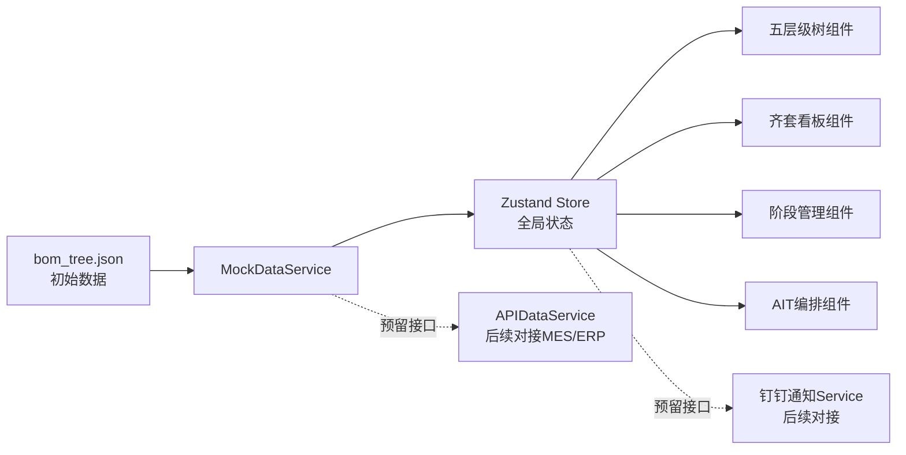

# PRD — 卫星制造项目管理系统（Demo）

> **版本**：v1.0-draft
> **日期**：2026-06-26
> **编写人**：许清楚（产品经理）
> **状态**：待评审

---

## 1. 项目信息

| 字段 | 内容 |
|------|------|
| **Language** | 简体中文 |
| **Programming Language** | Vite + React + TypeScript + MUI + Tailwind CSS |
| **Project Name** | `satellite_mfg_mgmt` |
| **数据来源** | 本地 JSON（`bom_tree.json`）+ 前端状态管理，预留接口层 |
| **原始需求复述** | 为卫星制造项目搭建一套多层级数据维护与阶段管理系统。支持「批次→整星→分系统→单机→元器件」五层级 BOM 结构导入与齐套展示；按设计/投产/联试/AIT 四阶段管理进度；AIT 阶段支持总装、电测、热试验等 6 类工作的人工编排；苹果官网风格 UI，日夜切换，Mac/Windows/移动端 Chrome 适配；预留自动取数与钉钉协作接口。 |

### 1.1 业务背景

卫星制造是一个长周期、多专业协同的复杂工程。当前项目（灵犀10B）包含 **1 颗整星、12 个分系统、119 条物料**（39 台设备单机 + 67 项零部件/电缆 + 1 整星 + 12 分系统）。项目经理需要在一张图上看清「齐套了没有、各阶段卡在哪、下一步干什么」，而现有方式依赖 Excel + 口头沟通，信息分散、更新滞后。

本 Demo 的目标是用最小可演示功能，验证「层级化数据 + 阶段化推进 + 齐套可视化」这一产品方向。

### 1.2 BOM 数据概览（已解析）

```
灵犀10B（ROOT）
└── ST01-220041 灵犀10B卫星（整星, L1）
    ├── SB03 姿轨控分系统 ──────────── 9 台单机（飞轮/星敏/陀螺/太敏/磁强计/磁力矩器）
    ├── SB04 推进分系统 ────────────── 4 台单机（推力器/电源处理单元/管路模块/气瓶组件）
    ├── SB05 能源分系统 ────────────── 4 台单机（太阳翼/体装太阳翼/蓄电池组/MPPT控制器）
    ├── SB08 综电分系统 ────────────── 3 台单机（SMU/对天导航天线A/B）
    ├── SB09 测控数传分系统 ────────── 6 台单机（X波段一体机/测控天线/数传天线/导航滤波器）
    ├── SB06 Ka-5G NTN通信载荷 ────── 4 台单机（Ka收发天线/基带处理机/驯服时钟）
    ├── SB06 频谱监测载荷 ──────────── 5 台单机（频谱转发/UHF天线/X天线/射频前端）
    ├── SB06 光学遥感载荷 ──────────── 2 台单机（光学相机/配电热控单元）
    ├── SB06 手机直连搭载载荷 ──────── 3 台单机（载荷管理单元/手机载荷B/对数周期天线）
    ├── SB01 结构分系统 ────────────── 2 项零部件（结构舱/总装直属件）
    ├── SB02 热控分系统 ────────────── 0 台单机（暂空）
    └── SB09 总体电路分系统 ────────── 64 项零部件（低频电缆×27 + 射频电缆×35 + 行程开关×2）
```

---

## 2. 产品目标

| # | 目标 | 衡量标准 |
|---|------|----------|
| **G1** | **一张图看清齐套全貌** — 将 BOM 五层级结构与齐套状态在同一界面可视化，替代 Excel 人工核对 | Demo 中 119 条物料的层级关系与齐套率可在一屏内概览，支持逐层下钻 |
| **G2** | **按阶段跟踪制造进度** — 设计/投产/联试/AIT 四阶段进度透明化，每阶段关注点差异化呈现 | 各阶段关键指标（如设计阶段的投产状态/交付时间）可在阶段视图直接查看，支持临时任务录入 |
| **G3** | **苹果级视觉体验 + 多端可用** — 以苹果官网设计语言为基准，Mac/Windows/移动端 Chrome 均可流畅操作 | 日/夜模式一键切换无闪烁；移动端核心数据可查看（树/齐套/阶段），桌面端全功能可编辑 |

---

## 3. 用户故事

| # | 角色 | 故事 | 验收标准 |
|---|------|------|----------|
| **US1** | 项目经理 | 作为一个项目经理，我想在一个页面看到整星 BOM 的层级结构和齐套率，这样我能快速判断项目物料准备进度 | 首页/项目总览页展示五层级树 + 齐套百分比；点击任一分系统可下钻到单机列表 |
| **US2** | 计划调度员 | 作为一个计划调度员，我想导入 BOM 文件并查看每个单机的齐套情况，这样我能发现缺件并及时催办 | BOM 导入后自动构建层级树；齐套看板用颜色区分「已齐套/部分齐套/未齐套」；可按分系统筛选 |
| **US3** | 总装工程师 | 作为一个总装工程师，我想在 AIT 阶段看到总装、电测、热试验等工作的排列顺序和状态，这样我知道下一步该干什么 | AIT 视图以看板/列表展示 6 类工作项；可拖拽调整顺序；可标记状态（待开始/进行中/完成）；可人工新增工作项 |
| **US4** | 项目经理 | 作为一个项目经理，我想在各阶段添加临时任务需求，这样我能灵活应对计划外的制造事项 | 每个阶段视图有「添加任务」入口；临时任务与 BOM 单机关联或独立存在；在阶段看板中可见 |
| **US5** | 制造团队成员 | 作为一个制造团队成员，我想在手机上查看项目进度和我的任务，这样我在车间也能获取信息 | 移动端 Chrome 打开可查看层级树/齐套看板/阶段进度；布局自适应不出现横向滚动 |

---

## 4. 需求池

### P0 — Demo 必须实现

| ID | 需求 | 描述 | 验收标准 |
|----|------|------|----------|
| P0-1 | **五层级数据树** | 以可折叠树形组件展示「批次→整星→分系统→单机→元器件」五层级。Demo 数据基于 `bom_tree.json`，其中批次为虚拟根节点、元器件层级暂用占位（BOM 数据最深到单机/零部件级） | 树形展示 1 整星 + 12 分系统 + 119 物料；支持展开/折叠；节点显示料号+品名；点击节点展开详情面板 |
| P0-2 | **BOM 齐套看板** | 以分系统为维度展示齐套率（齐套数/总数），用进度条 + 色块标识状态。支持按「电性件/鉴定件/正样件」三种单机状态筛选 | 12 个分系统齐套率一目了然；色块：绿=全齐套、黄=部分、红=未齐套；点击分系统下钻到单机明细 |
| P0-3 | **单机三状态管理** | 每台单机（EQ 开头）维护三种状态：电性件 / 鉴定件 / 正样件。每种状态独立标注是否齐套。至少一种状态在整星中存在 | 单机详情面板含三状态开关/标签，可勾选「在整星中」；齐套看板可按状态维度汇总 |
| P0-4 | **四阶段管理框架** | 顶部/侧边导航展示四个阶段：设计阶段、投产阶段、联试阶段、AIT阶段。切换阶段时视图内容切换为该阶段关注点 | 四个 Tab/步骤条可切换；当前阶段高亮；阶段切换保留数据状态 |
| P0-5 | **设计阶段视图** | 聚焦单机的「是否投产」和「交付时间」两个字段 | 列表展示所有单机，含投产状态（已投产/未投产）+ 交付日期列；支持行内编辑日期 |
| P0-6 | **联试阶段视图** | 聚焦正样件/电性件状态单机的交付情况 | 列表筛选展示含正样件或电性件的单机；展示交付状态（已交付/未交付/延期） |
| P0-7 | **AIT 任务编排** | AIT 阶段预置 6 类工作：总装、电测、热试验、力学试验、噪声试验、EMC试验。以看板形式展示，支持拖拽排序、状态标记、人工新增 | 6 类工作以卡片展示；可拖拽调整顺序；可新增自定义工作项；每个工作项可标记状态 |
| P0-8 | **苹果风格 UI + 日夜切换** | 遵循苹果官网设计语言：大留白、SF Pro 字体替代（Inter/PingFang）、圆角卡片、微妙阴影、毛玻璃效果。支持日/夜模式一键切换，无闪烁过渡 | 视觉审查通过；日夜切换有平滑过渡动画；颜色变量统一管理 |
| P0-9 | **多端适配** | Mac Chrome / Windows Chrome / 移动端 Chrome 响应式适配。移动端查看为主，桌面端全功能 | 桌面端 ≥1280px 全功能；平板 768-1280px 紧凑布局；移动端 <768px 单列流式布局，核心数据可查看 |

### P1 — Demo 增强

| ID | 需求 | 描述 |
|----|------|------|
| P1-1 | **投产阶段视图** | 投产阶段关注单机的投产进度跟踪，展示投产单机的生产状态、预计完成时间 |
| P1-2 | **数据人工维护** | 全量支持人工编辑：单机状态切换、齐套标记、交付日期、阶段任务编辑。所有编辑操作即时保存到前端状态 |
| P1-3 | **层级数据搜索** | 支持按料号/品名搜索树节点，搜索结果高亮并自动展开父级 |
| P1-4 | **齐套看板下钻交互** | 点击分系统进度条，平滑展开单机明细列表，支持在明细中直接修改齐套状态 |
| P1-5 | **阶段间数据联动** | 设计阶段标记「已投产」的单机，自动出现在投产阶段；联试阶段自动过滤出已交付单机 |
| P1-6 | **AIT 工作详情** | 每个 AIT 工作项可展开详情：关联单机、计划时间、实际时间、负责人、备注 |

### P2 — 后续迭代

| ID | 需求 | 描述 |
|----|------|------|
| P2-1 | **自动取数接口层** | 预留接口层（Service 抽象），后续对接 MES/ERP 等系统自动获取齐套、生产、交付数据。当前用 Mock Service 实现 |
| P2-2 | **钉钉协作接口** | 预留钉钉消息推送接口（任务分配通知、齐套变更通知、阶段里程碑提醒）。当前仅预留 Interface 定义 |
| P2-3 | **元器件层级数据** | 在单机下挂接元器件（BOM 第五层级），展示元器件齐套与追溯信息 |
| P2-4 | **批次管理** | 支持多批次管理，同型号卫星可分批投产，批次间数据隔离 |
| P2-5 | **权限与多人协作** | 基于角色的权限控制（项目经理/调度员/工程师/查看者），支持多人同时编辑与冲突提示 |
| P2-6 | **数据导出** | 支持将齐套报告、阶段进度报告导出为 Excel/PDF |
| P2-7 | **甘特图/时间线** | 阶段与任务的时间线可视化，支持里程碑标记 |

---

## 5. 技术规范

### 5.1 技术栈

| 层级 | 技术选型 | 说明 |
|------|----------|------|
| 构建工具 | Vite 5+ | 快速 HMR，适合 Demo |
| 框架 | React 18 + TypeScript | 类型安全 |
| UI 库 | MUI (Material-UI) v5 | 组件丰富，主题定制能力强，适合苹果风格覆盖 |
| 样式 | Tailwind CSS 3+ | 原子化样式，快速布局 |
| 状态管理 | Zustand | 轻量，适合 Demo 规模 |
| 数据 | 本地 JSON + Mock Service | `bom_tree.json` 作为初始数据；Service 层抽象，便于后续接接口 |
| 图标 | MUI Icons / Lucide | 统一图标风格 |
| 图表 | Recharts 或 MUI X Charts | 齐套率环形图/进度条 |

### 5.2 数据架构



### 5.3 数据模型（核心实体）

```
Project（项目/批次）
├── id, name, satelliteModel
├── Satellite（整星）
│   ├── partNo, name
│   ├── Subsystems[]（分系统）
│   │   ├── partNo, name
│   │   └── Units[]（单机/零部件）
│   │       ├── partNo, name, spec, manufacturer...
│   │       ├── status: { electrical: bool, qualification: bool, flight: bool }
│   │       ├── inSatellite: string[]  // 在整星中的状态
│   │       ├── isKitComplete: bool
│   │       ├── productionStatus: 'not_started' | 'in_progress' | 'completed'
│   │       └── deliveryDate: string
│   └── Phases[]（阶段）
│       ├── type: 'design' | 'production' | 'integration' | 'ait'
│       ├── Tasks[]（临时任务）
│       └── AitWorks[]（仅AIT阶段：总装/电测/热试验...）
```

---

## 6. UI 设计稿说明

> **设计基调**：苹果官网风格 — 大留白、SF Pro 字体感（Inter / PingFang SC）、12-16px 圆角卡片、`0 2px 12px rgba(0,0,0,0.06)` 微妙阴影、毛玻璃导航栏、系统级日夜色板。

### 6.1 整体布局

```
┌─────────────────────────────────────────────────────┐
│  [☰] 灵犀10B 卫星制造管理系统        [☀/🌙] [👤]    │  ← 毛玻璃顶栏, sticky
├──────────┬──────────────────────────────────────────┤
│          │                                          │
│  📊 总览  │                                          │
│  🌳 层级  │            主内容区                      │
│  ✅ 齐套  │       （根据导航切换）                    │
│  📋 阶段  │                                          │
│  ⚙️ AIT  │                                          │
│          │                                          │
├──────────┴──────────────────────────────────────────┤
│  灵犀10B · 119 物料 · 齐套率 68% · 当前: 设计阶段    │  ← 状态栏
└─────────────────────────────────────────────────────┘

移动端：侧边栏收为汉堡菜单，主内容区单列流式
```

### 6.2 页面一：项目总览（首页）

| 区域 | 内容 |
|------|------|
| **顶部 Hero** | 项目名称「灵犀10B」+ 卫星型号 + 整体进度环形图（4 阶段完成度） |
| **核心指标卡** | 4 张卡片横排：物料总数(119) / 齐套率(68%) / 已投产单机数 / AIT工作项数 |
| **分系统齐套缩略** | 12 个分系统的小型进度条横排，点击跳转齐套看板 |
| **阶段进度条** | 设计→投产→联试→AIT 横向步骤条，当前阶段高亮 |

```
┌──────────────────────────────────────────┐
│         灵犀10B 卫星制造项目               │
│              ◐ 45% 完成                   │
├──────────┬──────────┬──────────┬─────────┤
│ 物料 119  │ 齐套 68% │ 投产 23  │ AIT  6  │
├──────────┴──────────┴──────────┴─────────┤
│  分系统齐套概览                            │
│  姿轨控 ████████░░ 89%                    │
│  推进   ██████░░░░ 67%                    │
│  能源   █████████░ 95%  ...               │
├──────────────────────────────────────────┤
│  ● 设计 ── ○ 投产 ── ○ 联试 ── ○ AIT      │
└──────────────────────────────────────────┘
```

### 6.3 页面二：层级数据树

| 区域 | 内容 |
|------|------|
| **左侧树** | 可折叠五层级树：批次 → 整星 → 分系统 → 单机 → 元器件（Demo 元器件层占位）。每级图标区分（🛰️整星 / 📦分系统 / 🔧单机 / ⚡元器件）。节点显示料号 + 品名 + 齐套色点 |
| **右侧详情** | 选中节点后展示详情卡：基本信息（料号/品名/规格/厂家/质量等级/用量/位号）+ 三状态（电性件/鉴定件/正样件）勾选 + 齐套标记 + 投产状态 + 交付日期 |

```
┌────────────────────┬───────────────────────────┐
│ 🛰️ ST01 灵犀10B卫星 │  反作用飞轮               │
│  ▼ 📦 SB03 姿轨控   │  ┌─────────────────────┐  │
│    🔧 EQ0101 反作.. │  │ 料号: EQ0101-220010 │  │
│    🔧 EQ0102 星敏   │  │ 厂家: —              │  │
│    🔧 EQ0103 陀螺A  │  │ 用量: 1   位号: —    │  │
│    ...              │  ├─────────────────────┤  │
│  ▶ 📦 SB04 推进     │  │ 状态:               │  │
│  ▶ 📦 SB05 能源     │  │ ☑ 电性件  ☐ 鉴定件  │  │
│  ...                │  │ ☑ 正样件 [在整星中]  │  │
│  ▶ 📦 SB09 总体电路 │  ├─────────────────────┤  │
│    (64项零部件)     │  │ 齐套: ✅ 已齐套      │  │
│                    │  │ 投产: 已投产          │  │
│                    │  │ 交付: 2026-08-15     │  │
│                    │  └─────────────────────┘  │
└────────────────────┴───────────────────────────┘
```

### 6.4 页面三：BOM 齐套看板

| 区域 | 内容 |
|------|------|
| **顶部筛选** | 状态筛选（全部/电性件/鉴定件/正样件）+ 搜索框 |
| **分系统卡片网格** | 12 张卡片网格布局（3-4列），每张卡片：分系统名 + 齐套环形图 + 齐套数/总数 + 色块状态条 |
| **下钻明细** | 点击卡片展开/跳转该分系统下所有单机的齐套明细表 |

```
┌──────────────────────────────────────────────┐
│  [全部状态 ▾]  [🔍 搜索料号/品名]              │
├──────────────┬──────────────┬────────────────┤
│  姿轨控       │  推进         │  能源           │
│   ◕ 8/9      │   ◕ 3/4      │   ◕ 4/4        │
│  89% ██████░ │  67% █████░░ │  100% ████████ │
├──────────────┼──────────────┼────────────────┤
│  综电         │  测控数传     │  Ka-5G NTN     │
│   ◕ 3/3      │   ◕ 5/6      │   ◕ 2/4        │
│  100% ████████│  83% ███████░│  50% ████░░░░  │
├──────────────┼──────────────┼────────────────┤
│  ...          │  ...         │  总体电路       │
│              │              │   ◕ 40/64      │
│              │              │  63% █████░░░  │
└──────────────┴──────────────┴────────────────┘
```

### 6.5 页面四：阶段管理

| 区域 | 内容 |
|------|------|
| **阶段切换** | 顶部步骤条：① 设计 → ② 投产 → ③ 联试 → ④ AIT，当前阶段高亮加粗 |
| **阶段内容** | 根据选中阶段切换视图：<br>• **设计阶段**：单机列表（料号/品名/是否投产/交付时间），行内可编辑<br>• **投产阶段**：已投产单机的生产进度跟踪<br>• **联试阶段**：正样件/电性件单机的交付状态列表<br>• **AIT阶段**：跳转 AIT 编排视图 |
| **临时任务** | 每个阶段右上角「+ 添加任务」按钮，弹窗输入任务名/关联单机/负责人/截止日期 |

```
┌──────────────────────────────────────────────┐
│  ● 设计 ── ○ 投产 ── ○ 联试 ── ○ AIT   [+任务]│
├──────────────────────────────────────────────┤
│  设计阶段 · 关注单机投产与交付                  │
├────────┬──────────┬──────────┬───────────────┤
│ 料号    │ 品名      │ 是否投产  │ 交付时间       │
├────────┼──────────┼──────────┼───────────────┤
│EQ0101  │ 反作用飞轮│ ✅ 已投产 │ 2026-08-15 📅 │
│EQ0102  │ 星敏      │ ✅ 已投产 │ 2026-08-20 📅 │
│EQ0307  │ 推力器    │ ❌ 未投产 │ —             │
│...     │          │          │               │
├────────┴──────────┴──────────┴───────────────┤
│  📋 临时任务 (2)                               │
│  • 飞轮接口协调会 — 负责人:张工 — 07/05         │
│  • 星敏验收标准确认 — 负责人:李工 — 07/10       │
└──────────────────────────────────────────────┘
```

### 6.6 页面五：AIT 任务编排

| 区域 | 内容 |
|------|------|
| **看板列** | 默认 3 列看板：待开始 / 进行中 / 已完成 |
| **工作卡片** | 6 类预置工作以卡片形式展示：总装、电测、热试验、力学试验、噪声试验、EMC试验。卡片含：工作名、关联单机、计划时间、序号 |
| **拖拽排序** | 卡片可在列内拖拽排序（调整执行顺序），可跨列拖拽（变更状态） |
| **新增工作** | 「+ 新增工作项」可添加自定义 AIT 工作（如「振动试验复测」） |
| **多次执行** | 同一工作类型可创建多个卡片（如电测执行 2 次），序号自动递增 |

```
┌─────────────┬─────────────┬─────────────┐
│  待开始 (3)  │  进行中 (1)  │  已完成 (2)  │
├─────────────┼─────────────┼─────────────┤
│ ┌─────────┐ │ ┌─────────┐ │ ┌─────────┐ │
││① 总装    │ │ │③ 电测#1 │ │ │⑤ 力学试验│ │
││ 关联:全星│ │ │ 关联:SMU│ │ │ 07/01完成│ │
││ 08/01    │ │ │ 进行中  │ │ └─────────┘ │
│└─────────┘ │ └─────────┘ │ ┌─────────┐ │
│ ┌─────────┐ │             │ │⑥ 噪声试验│ │
││② 热试验  │ │             │ │ 07/05完成│ │
││ 08/10    │ │             │ └─────────┘ │
│└─────────┘ │             │             │
│ ┌─────────┐ │             │             │
││④ EMC试验 │ │             │             │
││ 08/15    │ │             │             │
│└─────────┘ │             │             │
├─────────────┴─────────────┴─────────────┤
│  [+ 新增工作项]   提示: 可拖拽调整顺序    │
└──────────────────────────────────────────┘
```

### 6.7 日夜模式色板

| 语义 | 日间模式 | 夜间模式 |
|------|----------|----------|
| 背景 | `#FFFFFF` / `#F5F5F7` | `#000000` / `#1D1D1F` |
| 卡片 | `#FFFFFF` | `#1C1C1E` |
| 主文字 | `#1D1D1F` | `#F5F5F7` |
| 次文字 | `#86868B` | `#A1A1A6` |
| 强调色 | `#0071E3`（Apple Blue） | `#0A84FF` |
| 成功/齐套 | `#34C759`（Apple Green） | `#30D158` |
| 警告/部分 | `#FF9500`（Apple Orange） | `#FF9F0A` |
| 错误/未齐套 | `#FF3B30`（Apple Red） | `#FF453A` |

---

## 7. Demo 范围与边界

### 7.1 Demo 包含（In Scope）

| 模块 | 范围 |
|------|------|
| 数据 | 基于 `bom_tree.json` 的 119 条物料，前端 Zustand 状态管理 |
| 五层级树 | 批次(虚拟) → 整星 → 分系统 → 单机 → 元器件(占位) |
| 齐套看板 | 12 分系统齐套率 + 下钻单机明细 + 三状态筛选 |
| 阶段管理 | 设计/投产/联试/AIT 四阶段切换 + 设计/联试视图 + 临时任务 |
| AIT 编排 | 6 类预置工作 + 拖拽排序 + 状态标记 + 新增工作 |
| UI | 苹果风格 + 日夜切换 + 三端响应式 |
| 数据维护 | 人工编辑（状态/齐套/日期/任务）|

### 7.2 Demo 不包含（Out of Scope）

- ❌ 真实后端接口对接（仅 Mock Service + 预留 Interface）
- ❌ 钉钉真实对接（仅预留接口定义）
- ❌ 元器件层级真实数据（占位）
- ❌ 多批次管理
- ❌ 用户权限与登录系统
- ❌ 数据导出
- ❌ 持久化存储（刷新后数据重置，或用 localStorage 简单持久化）

---

## 8. 待确认问题

| # | 问题 | 影响范围 | 建议 |
|---|------|----------|------|
| **Q1** | **批次层级**：用户需求提到五层级含「批次」，但 BOM 数据中无批次信息。Demo 是否用单一虚拟批次（如「灵犀10B-批次01」）作为根节点？ | 数据模型、树结构 | Demo 用虚拟批次根节点，多批次管理放 P2 |
| **Q2** | **元器件层级**：BOM 数据最深到单机/零部件（EQ/PT），无元器件明细。Demo 中元器件层级如何呈现？ | 树结构 | Demo 元器件层级显示「暂无数据」占位节点，真实数据放 P2 |
| **Q3** | **齐套判定逻辑**：BOM 数据中无齐套相关字段（到货状态等）。Demo 的齐套数据从何而来？ | 齐套看板 | Demo 用 Mock 数据随机生成齐套状态，后续对接 MES 获取真实数据 |
| **Q4** | **单机三状态语义**：「电性件/鉴定件/正样件」是指同一台单机会经历三种状态，还是不同物理实物？齐套是按状态独立判定吗？ | 数据模型、看板 | 按用户描述「每台单机有三种状态，至少一种在整星中」，理解为同一单机有三个独立实物，各自独立判定齐套 |
| **Q5** | **投产阶段关注点**：用户需求明确列出了设计/联试/AIT 阶段的关注点，但未说明「投产阶段」具体关注什么。 | 阶段视图 | Demo 投产阶段暂以「已投产单机的生产进度跟踪」为内容，需向用户确认 |
| **Q6** | **AIT 工作与单机的关联**：AIT 6 类工作（总装/电测等）是否需要关联到具体单机？还是面向整星？ | AIT 编排 | Demo 中总装面向整星，电测/试验可关联具体单机或分系统，需确认 |
| **Q7** | **数据持久化**：Demo 刷新后是否需要保留编辑数据？还是每次从初始 JSON 重新加载？ | 技术实现 | 建议用 localStorage 简单持久化，刷新不丢数据 |
| **Q8** | **PT 零部件处理**：BOM 中有 67 条 PT 开头零部件（电缆/开关等），它们在齐套看板中是否与 EQ 单机同等展示？还是归入分系统级齐套？ | 齐套看板 | 建议在分系统齐套统计中纳入 PT 零部件，但单机三状态管理仅针对 EQ 设备 |

---

## 9. 验收标准（Demo 交付）

1. **数据加载**：打开应用，5 秒内加载 `bom_tree.json` 并渲染完整五层级树
2. **树交互**：可展开/折叠所有层级，点击节点显示详情，搜索可定位节点
3. **齐套看板**：12 分系统齐套率正确计算并展示，支持三状态筛选与下钻
4. **阶段切换**：四阶段 Tab 切换流畅，各阶段视图内容正确
5. **AIT 编排**：6 类工作可拖拽排序、跨列移动、新增自定义工作
6. **日夜切换**：一键切换无闪烁，所有页面配色一致
7. **多端适配**：Mac/Windows Chrome 1280px+ 全功能；移动端 Chrome 核心数据可查看
8. **人工编辑**：状态/齐套/日期/任务等编辑操作即时生效并反映到看板

---

> **备注**：本 PRD 为 Demo 版本，聚焦核心功能可演示性。所有 P2 项为后续产品化方向，需在 Demo 验证通过后另行规划。
